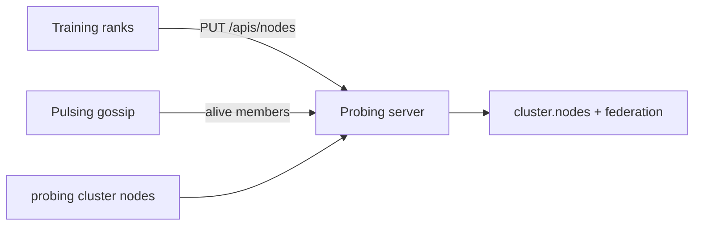

# Cluster Management with Pulsing

Design note: reuse [Pulsing](https://github.com/DeepLink-org/Pulsing) gossip membership and
failure detection for probing cluster discovery, while keeping probing's training semantics
(`rank`, `role`, federation tags).

!!! note "Language"
    The full design narrative is maintained in Chinese:
    **[中文版](/zh/design/cluster-pulsing/)**. This page is an English summary.

## Current probing cluster model

- **Store**: in-memory `probing_proto::Cluster`, keyed by `host:addr`, with `rank_index`.
- **Node fields**: `host`, `addr`, ranks, `role_name` (torchrun), **`role`** (probing parallel
  key like `dp=2,pp=1,tp=0`), `status`, `timestamp`.
- **Write path**: rank 0 calls `update_node` locally; other ranks `PUT /apis/nodes` to the
  report address (usually rank 0).
- **Read path**: `GET /apis/nodes`, Web cluster view, `cluster.nodes` SQL table.
- **Limitation**: no built-in failure detection; liveness depends on app heartbeats.

CLI today: `probing -t <endpoint> cluster nodes` and `cluster query`.

## What Pulsing adds

- SWIM-style gossip (`GossipCluster`) with PFail → Fail detection.
- `alive_members()` / HTTP `GET /cluster/members` for membership without app polling.

## Design goals

1. **Discovery & liveness** from Pulsing; probing keeps rank/role/world_size semantics.
2. **No breaking API** — existing `PUT /apis/nodes`, `cluster.nodes`, `global.*` federation unchanged.
3. **Optional integration** — probing works without Pulsing; Pulsing enhances multi-node discovery.

## Proposed integration (summary)

- Map Pulsing `MemberInfo` → probing `Node` skeleton; merge training-reported fields on heartbeat.
- Suspect/dead members surface in `cluster.nodes.status` for Web/CLI.
- Federation rewrite (`_rank`, `_role`, …) unchanged — see [Distributed](distributed.md).

## Related

- **[Distributed](distributed.md)** — `global.*`, `cluster query`, `role`
- **[Cluster with Pulsing (中文)](/zh/design/cluster-pulsing/)** — full design
- **[SQL Tables](../reference/sql-tables.md)** — `cluster.nodes` columns
