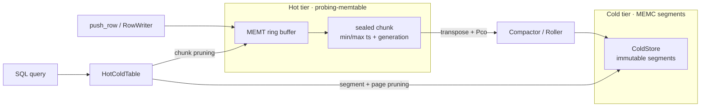

# Data Layer

Probing's data layer is a **per-process, crash-resilient, time-retained data plane** for
observability data (metrics, samples, traces). Every producer writes through one in-house
columnar store, [`probing-memtable`](https://github.com/DeepLink-org/probing), and every
consumer queries it through SQL (DataFusion). It is built as **two tiers**:

- a **hot tier** (`MEMT`): a fixed-capacity ring buffer for the live window — constant memory,
  zero-allocation writes;
- a **cold tier** (`MEMC`): immutable, compressed segments for time retention beyond the ring,
  with whole-file eviction.

A single SQL time predicate prunes and queries both tiers at once.

## Design Goals

- **Bounded resource use.** The hot ring never grows; the cold store is capped by a byte budget
  and TTL.
- **Crash resilience.** A process killed mid-write never surfaces torn rows; cold segments
  recover from a torn tail via forward scan.
- **Time retention.** Data that scrolls out of the hot ring survives in cold segments and stays
  queryable.
- **One write path, one read path.** Producers (server, Python/Torch extensions) all write
  `probing-memtable`; consumers all go through `probing-core::memtable_sql`.
- **Fork safety.** Correct under fork-heavy workloads (PyTorch DataLoader workers).

## Architecture

The hot tier is mapped read-only at query time; the cold tier is read via `SegmentReader`. The
`HotColdTable` provider unions them into one scan, deduplicating chunks that exist in both tiers.

## Hot Tier (MEMT)

### File Layout

Every MEMT buffer (heap, shared memory, or mmap'd file) begins with a 64-byte header (one cache
line), followed by per-column descriptors, then chunk data.

**Header v3 (64 bytes):**

| offset | size | field | notes |
|---|---|---|---|
| 0 | 4 | `magic` | `0x4D454D54` (`"MEMT"`) |
| 4 | 2 | `version` | 3 |
| 6 | 2 | `header_size` | 64 (validation) |
| 8 | 2 | `byte_order` | BOM `[0x01,0x02]` |
| 10 | 2 | `ts_col` | timestamp column index + 1 (0 = none) |
| 12 | 4 | `flags` | feature bits (`FLAG_DEDUP`, …) |
| 16 | 4 | `num_cols` | |
| 20 | 4 | `num_chunks` | ring slot count |
| 24 | 4 | `chunk_size` | bytes per chunk |
| 28 | 4 | `data_offset` | 64-aligned |
| 32 | 4 | `write_chunk` | `AtomicU32` — current ring slot |
| 36 | 4 | `refcount` | `AtomicU32` |
| 40 | 4 | `creator_pid` | |
| 44 | 4 | `_pad0` | alignment (was `write_lock` in v2) |
| 48 | 8 | `creator_start_time` | for PID-recycling detection during discovery |
| 56 | 8 | `_reserved` | reserved |

Bytes 0–31 are the **cold zone** (immutable after init); bytes 32–63 are the **hot zone**
(atomically mutated), split to avoid false sharing. Each chunk starts with a 40-byte
`ChunkHeader` carrying a `generation` counter and per-chunk `min_ts`/`max_ts` (`AtomicI64`).

> **v3** vs v2: `_pad0` became `ts_col`; dropped `write_lock` (single-writer model);
> `ChunkHeader` gained `min_ts`/`max_ts` (24 → 40 bytes).

### Backends

The same API backs three storage kinds:

- **Heap** — a private `Vec<u8>`; for in-process use.
- **POSIX shared memory** (`shm_open` + `mmap`) — cross-process, named, unlinked on cleanup.
- **File-backed mmap** — persistent, discoverable files under `<data_dir>/<pid>/`. This is what
  the SQL layer reads.

### Ring Buffer & Generations

Writes append to the current chunk; when a row does not fit, the writer advances to the next ring
slot (wrapping), sealing the previous chunk. Each slot carries a monotonically increasing
`generation` (incremented every time the ring wraps onto it). Readers materialize chunks in
**logical (oldest → newest) order** and re-check the generation after reading — a chunk recycled
mid-read is discarded rather than surfacing torn rows.

### Single-Writer Model (no lock)

MEMT is **single-writer**: exactly one writer owns each buffer (the creator process; any in-process
write is serialized by the caller). There is **no in-buffer write lock** — the writer appends rows
without any CAS or fence on a lock word. Readers are lock-free and never coordinated with the writer
except through the per-chunk `used` / `row_count` `Release` stores and `generation` re-validation.

Why this is safe and sufficient:

- Production uses one writer per table — the Python `ExternalTable` path writes one file per process
  (named `<data_dir>/<pid>/…`); a process restart means a new PID and a fresh file.
- Readers never wrote to the lock anyway; their correctness rides the `Release`/`Acquire` ordering on
  `used`/`row_count` plus the `generation` check on each chunk.
- Removing the lock also removes the fork-safety hazard the PID-stealing spinlock had to guard
  against (a forked child inheriting a cached start time and being mistaken for a recycled PID).

> The **cold tier (MEMC)** has a separate concurrency story — multiple compactor writers are
> distinguished by `writer_id` and segment isolation — and is unaffected by the MEMT single-writer
> model.

### Single-Writer Fast Path

Since data is generated **one row at a time**, the single-row commit path is tuned to be as cheap as
possible:

- **Zero per-row allocation.** The `RowWriter` streaming API encodes fields directly into the ring
  chunk; no `Vec<Value>` is built per row. (The `push_row(&[Value])` convenience API still works but
  asks the caller to materialize a value slice.)
- **No lock, no per-row `catch_unwind`.** With a single writer there is nothing to lock and nothing
  to release on panic, so neither a per-row CAS + `Release` fence nor a `catch_unwind`/`Drop` guard
  is needed.

Reader correctness is independent of the write path: row visibility always rides the `used` /
`row_count` `Release` stores in `finish()`. Measured single-thread `metrics` throughput (M4,
release): plain `push_row` + spinlock ≈ 18.8M rows/s → streaming, lock-free ≈ 29.9M rows/s
(**+59%** end to end).

### Timestamp Metadata

When the schema has an `I64` column named `timestamp` (or `ts`), `ts_col` records it and the write
path maintains per-chunk `min_ts`/`max_ts`. This is the basis for chunk-level time pruning at query
time, and it is **structurally identical** to the cold tier's page/segment time ranges.

## Cold Tier (MEMC)

### Directory & File Naming

Cold segments live in `<data_dir>/<pid>/cold` — co-located with, and scoped like, the hot ring
files, so cold data never mixes across processes. Each segment is named
`<writer_id>-<seq>.memc`, where `writer_id` is a hash of `(pid, start_time)` and `seq` is a
monotonically increasing sequence the `ColdStore` recovers on open.

### Segment Format

A segment is a sequence of 64-aligned blocks. All integrity checks use **xxh3-64 truncated to 32
bits**.

**Segment header (64 bytes):** `magic` (`"MEMC"`), `version` (1), BOM, `flags` (bit 0 = sealed),
`writer_pid`, `writer_start`, `created_unix_ms`, `footer_off` (0 until sealed), segment-wide
`ts_min`/`ts_max`, `page_count`, header checksum.

**Blocks** share a 64-byte header:

| magic | meaning |
|---|---|
| `MCTB` | table-definition block — declares a `table_id`, name, column dtypes, ts column |
| `MCPG` | page block — one columnar page for a `table_id` |
| `MCFT` | footer — page directory written on seal |

The page/block header carries `table_id`, `row_count`, `col_count`, `ts_min`/`ts_max`,
`payload_len`, `payload_xxh`, and — crucially for restart dedup — `source_gen` and `source_chunk`
(the hot-ring chunk generation and index this page was drained from; `u32::MAX` = not applicable).
The header is itself checksummed (covering `source_chunk`).

A single segment holds pages from **multiple tables**, distinguished by `table_id`. This decouples
file/directory count from table count: hundreds of tables share one set of segment files.

### Column Encodings

Each column is encoded independently (`ColEncoding`):

- **`Pco`** — numeric columns (`i32/i64/f32/f64/u32/u64`), compressed with Pco (level 8). Monotonic
  timestamp columns compress > 4×.
- **`RawFixed`** — `u8` (Pco offers no benefit for byte columns).
- **`RawVarLen`** — `Str`/`Bytes`, stored as concatenated `[u32 len][bytes]` entries (Pco has no
  string support).

### Crash Recovery

- A **sealed** segment is read via its footer page directory — O(1) location of every page.
- An **unsealed or torn** segment is recovered by **forward scan**: walk blocks from the start,
  verifying each block's header and payload checksum, stopping at the first bad block and dropping
  the torn tail. Table-definition blocks are always scanned (cheap, and they precede pages).

There is no heuristic that tries to repair a half-written record.

!!! warning "Durability"
    Pages are not `fsync`'d individually (only `sync_data` on seal). A `SIGKILL` may lose
    not-yet-flushed tail pages of the open segment. This is acceptable for observability data but
    is an explicit trade-off.

## Compactor (Roller)

The `Compactor` drains newly-sealed hot chunks into cold segments.

- **Drain semantics.** Only `Sealed` chunks are drained (never the currently-writing chunk). Rows
  are transposed to columns; the chunk's `generation` is re-checked before and after — if the ring
  recycled it, the page is dropped and retried next pass. Draining is **idempotent**: a per-chunk
  `drained_gen` high-water mark skips already-compacted chunk generations.
- **Rolling.** The open segment is sealed and a new one started when it reaches
  `target_segment_bytes` (default 64 MiB — the main fragmentation knob), or when it exceeds
  `max_segment_age` (default 300 s, so low-rate tables still become queryable), or on explicit
  flush.
- **Eviction.** `enforce` deletes oldest segments past a byte budget (`max_total_bytes`) or TTL,
  always protecting the newest segment.

### Exactly-Once Across Restarts

`drained_gen` is in-memory, so a naive restart over a persistent cold dir would re-compact
chunks still resident in the hot ring, producing duplicate rows. `prime_from_cold()` rebuilds the
watermark on startup: it scans existing cold segments and, per `(table, source_chunk)`, takes the
max `source_gen`, merging it into `drained_gen` the first time a table is seen. The result is
**exactly-once** even across restarts.

## Runtime Owner

`ColdCompactor` is a process-global singleton (modeled on the task-stats worker) that gives the
compactor a single lifecycle home:

- a background thread **rediscovers** ring files under `<data_dir>/<pid>/` each pass (tables appear
  over time), drains each into the shared `ColdStore`, rolls by age, and enforces the budget;
- on startup it calls `prime_from_cold()`; on stop it flushes (seals the open segment).

It is **opt-in** (off by default) to avoid spawning a compaction thread in every forked worker.
Configuration is applied via the `MemTableProbeExtension` option surface or environment variables; the
server calls `start_cold_compaction_from_env()` at engine init.

## SQL Integration

### Catalog Discovery

mmap files under `<data_dir>/<pid>/` are exposed as DataFusion tables, with the filename mapping
to `(schema, table)`:

- first `.` splits schema vs table — `acme.actors` → schema `acme`, table `actors`;
- no `.` → schema `memtable` (e.g. `metrics` → `memtable.metrics`).

`DynamicMmapCatalog` merges these dynamic schemas with the static `probe` catalog. A query like
`SELECT … FROM probe.memtable.metrics` resolves through `MmapFileSchemaProvider::table()`.

### Providers

- **`RingMmapTable`** — lazy provider over a hot ring file. Materializes Arrow batches at `scan()`
  time, pruning chunks whose `[min_ts, max_ts]` cannot match the query's time predicate.
- **`HotColdTable`** — unions a hot ring with its cold segments under one logical table (keyed by
  on-disk basename, so names never collide across schemas). This is what the catalog returns for
  ring tables.

### Three-Level Time Pruning

One time predicate prunes both tiers, in increasing granularity:

1. **Segment level** — skip a sealed cold segment whose header `ts_range` cannot match (no mmap).
2. **Page level** — skip cold pages outside the range via the page directory.
3. **Chunk level** — skip hot chunks outside the range via their `min_ts`/`max_ts`.

Hot and cold batches are handed to the scan as two partitions, so projection, filter, and limit
pushdown apply uniformly across both.

### Hot∪Cold Exactly-Once

A compacted chunk still lives in the hot ring until overwritten, so a naive union would
double-count it. `cold_scan` returns the set of `(source_chunk, source_gen)` the cold pages came
from; the hot side then **excludes** any chunk whose `(index, current generation)` is in that set.
Each row is counted exactly once, and the dedup is immune to ring recycling (the generation check
re-validates).

## Configuration Reference

| `SET memtable.*` | env | meaning | default |
|---|---|---|---|
| `cold_compaction` | `PROBING_COLD` | run the background compactor (`on`/`off`) | off |
| `cold_max_total_mb` | `PROBING_COLD_MAX_TOTAL_MB` | cold-store byte budget (MiB) | unlimited |
| `cold_ttl_secs` | `PROBING_COLD_TTL_SECS` | evict cold segments older than this | none |
| — | `PROBING_COLD_TARGET_MB` | segment roll size (MiB) | 64 |
| — | `PROBING_COLD_POLL_MS` | drain-pass interval | 2000 |
| — | `PROBING_COLD_MAX_AGE_SECS` | seal idle open segment after | 300 |

## Guarantees & Known Limits

**Guaranteed:**

- No torn rows on reads (generation re-validation); cold torn-tail recovery.
- Exactly-once across tiers (query dedup) and across restarts (`prime_from_cold`).
- Bounded hot memory; bounded cold bytes/TTL.
- Single-writer, lock-free hot path (MEMT); readers lock-free via generation re-validation.

**Known trade-offs (P2 backlog):**

- **Cold dir is per-PID.** Cross-process isolation is clean, but cold data is not persistent across
  restarts by default (a new PID is a new cold dir). `prime_from_cold` makes restart dedup correct
  whenever a persistent cold dir is configured.
- **No per-page `fsync`** — a `SIGKILL` may lose the open segment's not-yet-flushed tail.
- **No segment-level manifest** — multi-segment queries open each segment header to prune.
- **Pco level is fixed (8)** — not adapted per column.
- **Runtime is single-process per agent** — each training process owns local memtables. Cross-node
  aggregation is explicit via the `global` federated catalog (`global.schema.table`), HTTP
  `/apis/cluster/query`, and aggregate pushdown in `probing-core::federation`.

## Testing

The data layer ships with unit and end-to-end tests: hot-ring lock/recycle/fork tests
(`probing-memtable`), MEMC format/recovery/compactor tests (including restart-dedup with a negative
control), and SQL end-to-end tests that drain through the runtime owner and query the union through
the real catalog path (`probing-core::memtable_sql`).
