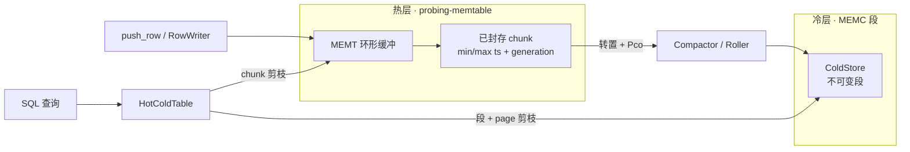

# 数据层

Probing 的数据层是一个面向观测数据（指标、采样、trace）的**单进程、抗崩溃、带时间保留的数据面**。
所有生产者都通过同一套自研列式存储 [`probing-memtable`](https://github.com/DeepLink-org/probing)
写入，所有消费者都通过 SQL（DataFusion）读取。它由**两层**构成：

- **热层**（`MEMT`）：固定容量的环形缓冲区，承载实时窗口——常量内存、零分配写入；
- **冷层**（`MEMC`）：不可变、压缩的段文件，用于超出环形窗口的时间保留，按整文件淘汰。

一条 SQL 时间谓词即可同时对两层做剪枝与查询。

## 设计目标

- **资源有界。** 热层环形缓冲永不增长；冷层受字节预算与 TTL 双重约束。
- **抗崩溃。** 写入中途被杀的进程不会暴露半行数据；冷段可从尾部撕裂中通过前向扫描恢复。
- **时间保留。** 滚出热层环形窗口的数据落入冷段，依然可查。
- **一条写路径、一条读路径。** 生产者（server、Python/Torch 扩展）统一写 `probing-memtable`；
  消费者统一走 `probing-core::memtable_sql`。
- **fork 安全。** 在大量 fork 的负载（如 PyTorch DataLoader worker）下依然正确。

## 总体架构

查询时热层以只读方式 mmap，冷层通过 `SegmentReader` 读取。`HotColdTable` provider 将两者合并为
一次扫描，并对同时存在于两层的 chunk 做去重。

## 热层（MEMT）

### 文件布局

每个 MEMT 缓冲区（堆、共享内存或 mmap 文件）都以 64 字节头部（一个 cache line）开始，随后是
逐列描述符，再是 chunk 数据。

**Header v3（64 字节）：**

| 偏移 | 大小 | 字段 | 说明 |
|---|---|---|---|
| 0 | 4 | `magic` | `0x4D454D54`（`"MEMT"`） |
| 4 | 2 | `version` | 3 |
| 6 | 2 | `header_size` | 64（仅校验） |
| 8 | 2 | `byte_order` | BOM `[0x01,0x02]` |
| 10 | 2 | `ts_col` | 时间戳列索引 + 1（0 = 无） |
| 12 | 4 | `flags` | 特性位（`FLAG_DEDUP` 等） |
| 16 | 4 | `num_cols` | |
| 20 | 4 | `num_chunks` | 环形槽位数 |
| 24 | 4 | `chunk_size` | 每个 chunk 字节数 |
| 28 | 4 | `data_offset` | 64 对齐 |
| 32 | 4 | `write_chunk` | `AtomicU32`——当前环形槽位 |
| 36 | 4 | `refcount` | `AtomicU32` |
| 40 | 4 | `creator_pid` | |
| 44 | 4 | `_pad0` | 对齐填充（v2 中为 `write_lock`） |
| 48 | 8 | `creator_start_time` | 用于发现期的 PID 回收检测 |
| 56 | 8 | `_reserved` | 预留 |

字节 0–31 是**冷区**（初始化后不可变），字节 32–63 是**热区**（运行时原子修改），二者分离以避免
伪共享。每个 chunk 以 40 字节的 `ChunkHeader` 开头，携带 `generation` 计数器及逐 chunk 的
`min_ts`/`max_ts`（`AtomicI64`）。

> **v3** 相对 v2：`_pad0` 改为 `ts_col`；移除 `write_lock`（单写者模型）；`ChunkHeader` 新增
> `min_ts`/`max_ts`（24 → 40 字节）。

### 三种后端

同一套 API 支撑三种存储形态：

- **堆内存**——私有 `Vec<u8>`，用于进程内使用；
- **POSIX 共享内存**（`shm_open` + `mmap`）——跨进程、具名、清理时 unlink；
- **文件 mmap**——持久、可发现的文件，位于 `<data_dir>/<pid>/`。SQL 层读取的正是这种。

### 环形缓冲与 generation

写入追加到当前 chunk；当一行放不下时，写入者推进到下一个环形槽位（绕回），同时封存上一个 chunk。
每个槽位携带单调递增的 `generation`（每次环形绕回到该槽位即自增）。读取者按**逻辑顺序（旧 → 新）**
物化 chunk，并在读取后复核 generation——若某 chunk 在读取过程中被回收，则丢弃而非暴露半行数据。

### 单写者模型（无锁）

MEMT 是**单写者**：每个缓冲区恰好一个写者拥有（创建者进程；进程内的写由调用方自行串行化）。缓冲区
内**没有写锁**——写者直接追加行，不在任何锁字上做 CAS 或屏障。读者免锁，与写者之间仅通过逐 chunk
的 `used` / `row_count` 的 `Release` 存储以及 `generation` 复核来协调。

为何安全且足够：

- 生产中每表单写者——Python `ExternalTable` 路径为每个进程写一个文件（命名为 `<data_dir>/<pid>/…`）；
  进程重启即换新 PID、换新文件；
- 读者本就不写锁字，其正确性依赖 `used`/`row_count` 的 `Release`/`Acquire` 次序以及逐 chunk 的
  `generation` 复核；
- 去掉锁还顺带消除了 PID 抢占自旋锁必须防范的 fork 隐患（fork 出的子进程继承了缓存的启动时间，被误
  判为 PID 回收）。

> **冷层（MEMC）** 是另一套并发模型——多个压实写者由 `writer_id` 与段隔离区分——不受 MEMT 单写者
> 模型影响。

### 单写者快路径

由于数据是**单条生成**的，单行提交路径被尽量做轻：

- **每行零分配。** `RowWriter` 流式 API 直接把各字段编码进 ring chunk，不再为每行构造
  `Vec<Value>`。（`push_row(&[Value])` 便捷接口仍可用，但要求调用方先物化一个 value 切片。）
- **无锁，也无每行 `catch_unwind`。** 单写者下既无需加锁，也无需在 panic 时释放锁，因此既不需要逐行
  的 CAS + `Release` 屏障，也不需要 `catch_unwind`/`Drop` 守卫。

读者正确性与写路径无关：行可见性始终依赖 `finish()` 中 `used` / `row_count` 的 `Release` 存储。单线程
`metrics` 实测吞吐（M4，release）：朴素 `push_row` + 自旋锁 ≈ 18.8M 行/s → 流式、免锁 ≈ 29.9M 行/s
（端到端 **+59%**）。

### 时间戳元数据

当 schema 含有名为 `timestamp`（或 `ts`）的 `I64` 列时，`ts_col` 记录其位置，写入路径维护逐
chunk 的 `min_ts`/`max_ts`。这是查询时 chunk 级时间剪枝的基础，并且与冷层的 page/段时间范围在
**结构上完全一致**。

## 冷层（MEMC）

### 目录与文件命名

冷段位于 `<data_dir>/<pid>/cold`——与热层环形文件同处一地、同样按进程隔离，因此冷数据绝不会跨进程
混淆。每个段命名为 `<writer_id>-<seq>.memc`，其中 `writer_id` 是 `(pid, start_time)` 的哈希，
`seq` 是 `ColdStore` 打开时恢复的单调递增序号。

### 段格式

一个段是一系列 64 对齐的 block。所有完整性校验都使用 **xxh3-64 截断为 32 位**。

**段头部（64 字节）：** `magic`（`"MEMC"`）、`version`（1）、BOM、`flags`（bit 0 = 已封存）、
`writer_pid`、`writer_start`、`created_unix_ms`、`footer_off`（封存前为 0）、段级
`ts_min`/`ts_max`、`page_count`、头部校验和。

**Block** 共享 64 字节头部：

| magic | 含义 |
|---|---|
| `MCTB` | 表定义 block——声明一个 `table_id`、表名、列 dtype、时间戳列 |
| `MCPG` | page（数据）block——某个 `table_id` 的一列页 |
| `MCFT` | footer——封存时写入的 page 目录 |

page/block 头部携带 `table_id`、`row_count`、`col_count`、`ts_min`/`ts_max`、`payload_len`、
`payload_xxh`，以及对重启去重至关重要的 `source_gen` 与 `source_chunk`（该 page 从哪个热层
chunk 的 generation 和索引抽取而来；`u32::MAX` = 不适用）。头部本身也带校验和（覆盖
`source_chunk`）。

单个段可容纳**多张表**的 page，以 `table_id` 区分。这让文件/目录数量与表数量解耦：成百上千张表
共享同一组段文件。

### 列编码

每列独立编码（`ColEncoding`）：

- **`Pco`**——数值列（`i32/i64/f32/f64/u32/u64`），用 Pco（level 8）压缩。单调时间戳列压缩比 > 4×；
- **`RawFixed`**——`u8`（Pco 对字节列无收益）；
- **`RawVarLen`**——`Str`/`Bytes`，以连续的 `[u32 len][bytes]` 条目存储（Pco 不支持字符串）。

### 崩溃恢复

- **已封存**段通过 footer 的 page 目录读取——O(1) 定位每个 page；
- **未封存或撕裂**的段通过**前向扫描**恢复：从头遍历 block，校验每个 block 的头部和 payload
  校验和，在第一个坏 block 处停止并丢弃撕裂的尾部。表定义 block 总会被扫描（开销小，且位于 page 之前）。

不存在任何试图修复半行记录的启发式逻辑。

!!! warning "持久性"
    page 不会逐个 `fsync`（仅在封存时 `sync_data`）。`SIGKILL` 可能丢失当前打开段尚未刷盘的尾部
    page。对观测数据可接受，但这是一个明确的取舍。

## Compactor（Roller）

`Compactor` 将新封存的热层 chunk 徕出（drain）到冷段。

- **徕出语义。** 只徕出 `Sealed` 状态的 chunk（绝不动正在写入的 chunk）。行被转置为列；徕出前后
  复核该 chunk 的 `generation`——若环形已回收它，丢弃该 page 并在下一轮重试。徕出是**幂等**的：
  逐 chunk 的 `drained_gen` 高水位跳过已压缩的 chunk generation。
- **滚动。** 当打开的段达到 `target_segment_bytes`（默认 64 MiB——主要的碎片化调节旋钮）、超过
  `max_segment_age`（默认 300 s，让低速率表也能及时可查），或显式 flush 时，封存当前段并新开一个。
- **淘汰。** `enforce` 在超出字节预算（`max_total_bytes`）或 TTL 时删除最旧的段，并始终保护最新段。

### 跨重启的精确一次

`drained_gen` 在内存中，因此朴素重启面对持久冷目录时会重新压缩仍驻留在热层环形中的 chunk，产生重复
行。`prime_from_cold()` 在启动时重建高水位：扫描已有冷段，按 `(表, source_chunk)` 取 `source_gen`
的最大值，在首次见到某表时合并进 `drained_gen`。结果即使跨重启也保证**精确一次**。

## 运行时 Owner

`ColdCompactor` 是进程级全局单例（仿照 task-stats worker），为 compactor 提供唯一的生命周期归宿：

- 后台线程每轮**重新发现** `<data_dir>/<pid>/` 下的环形文件（表会随时间出现），将每个徕出到共享的
  `ColdStore`，按时长滚动，并执行预算约束；
- 启动时调用 `prime_from_cold()`；停止时 flush（封存打开的段）。

它**默认关闭**（opt-in），以避免在每个 fork 出来的 worker 中都启动一个压缩线程。配置通过
`MemTableProbeExtension` 选项面或环境变量下发；server 在引擎初始化时调用
`start_cold_compaction_from_env()`。

## SQL 集成

### Catalog 发现

`<data_dir>/<pid>/` 下的 mmap 文件被暴露为 DataFusion 表，文件名映射到 `(schema, table)`：

- 首个 `.` 分隔 schema 与 table——`acme.actors` → schema `acme`、table `actors`；
- 无 `.` → schema `memtable`（例如 `metrics` → `memtable.metrics`）。

`DynamicMmapCatalog` 将这些动态 schema 与静态 `probe` catalog 合并。形如
`SELECT … FROM probe.memtable.metrics` 的查询经 `MmapFileSchemaProvider::table()` 解析。

### Provider

- **`RingMmapTable`**——热层环形文件之上的惰性 provider。在 `scan()` 时才物化 Arrow batch，并剪掉
  `[min_ts, max_ts]` 无法匹配查询时间谓词的 chunk。
- **`HotColdTable`**——将一个热层环形与其冷段合并为同一张逻辑表（以磁盘 basename 为键，使表名跨
  schema 永不冲突）。这是 catalog 为环形表返回的 provider。

### 三级时间剪枝

一条时间谓词以递增粒度剪枝两层：

1. **段级**——跳过头部 `ts_range` 无法匹配的已封存冷段（无需 mmap）；
2. **page 级**——通过 page 目录跳过范围外的冷 page；
3. **chunk 级**——通过 `min_ts`/`max_ts` 跳过范围外的热 chunk。

热、冷 batch 作为两个分区交给扫描，因此投影、过滤、limit 下推对两层一致生效。

### 热∪冷的精确一次

被压缩的 chunk 在被覆盖前仍存活于热层环形中，朴素的合并会重复计数。`cold_scan` 返回冷 page 来源的
`(source_chunk, source_gen)` 集合；热侧据此**排除**任何 `(索引, 当前 generation)` 落在该集合中的
chunk。每行恰好计数一次，且去重对环形回收免疫（generation 复核会重新验证）。

## 配置参考

| `SET memtable.*` | 环境变量 | 含义 | 默认 |
|---|---|---|---|
| `cold_compaction` | `PROBING_COLD` | 运行后台 compactor（`on`/`off`） | 关闭 |
| `cold_max_total_mb` | `PROBING_COLD_MAX_TOTAL_MB` | 冷层字节预算（MiB） | 无限 |
| `cold_ttl_secs` | `PROBING_COLD_TTL_SECS` | 淘汰早于此时长的冷段 | 无 |
| — | `PROBING_COLD_TARGET_MB` | 段滚动大小（MiB） | 64 |
| — | `PROBING_COLD_POLL_MS` | 排空轮询间隔 | 2000 |
| — | `PROBING_COLD_MAX_AGE_SECS` | 空闲打开段多久后封存 | 300 |

## 保证与已知边界

**已保证：**

- 读取无半行数据（generation 复核）；冷层尾部撕裂可恢复；
- 跨层精确一次（查询去重）与跨重启精确一次（`prime_from_cold`）；
- 热层内存有界；冷层字节/TTL 有界；
- 单写者、无锁热路径（MEMT）；读者通过 generation 复核免锁读取。

**已知取舍（P2 待办）：**

- **冷目录按 PID 隔离。** 跨进程隔离干净，但默认不跨重启持久化（新 PID = 新冷目录）。在配置了持久
  冷目录时，`prime_from_cold` 保证重启去重正确。
- **无逐 page `fsync`**——`SIGKILL` 可能丢失打开段尚未刷盘的尾部。
- **无段级 manifest**——多段查询需打开每个段头部做剪枝。
- **Pco level 固定（8）**——未按列自适应。
- **运行时为单进程 per agent**——每个训练进程拥有本地 memtable。跨节点聚合通过 `global`
  联邦 catalog（`global.schema.table`）、HTTP `/apis/cluster/query` 以及
  `probing-core::federation` 中的聚合下推显式完成。

## 测试

数据层附带单元与端到端测试：热层环形的锁/回收/fork 测试（`probing-memtable`）、MEMC 的
格式/恢复/compactor 测试（含带反例的重启去重），以及经运行时 owner 排空、再通过真实 catalog 路径
查询合并结果的 SQL 端到端测试（`probing-core::memtable_sql`）。
