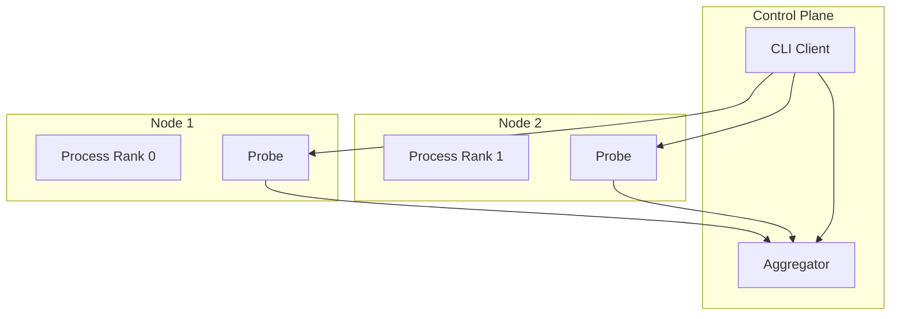

# Distributed Architecture

Probing supports monitoring and debugging distributed AI workloads across multiple nodes.

## Overview

Distributed training introduces challenges:

- Multiple processes across nodes
- Communication between ranks
- Synchronized debugging needs
- Cross-node data correlation

Probing addresses these through a distributed architecture.

## Architecture



## Process Discovery

### Local Discovery

```bash
# List all probing-enabled processes on local machine
probing list
```

### Remote Discovery

```bash
# Connect to remote node
probing -t node1:8080 list
probing -t node2:8080 list
```

### Cluster View

```bash
# List registered peers in the cluster view (connect to rank-0 / master endpoint)
probing -t rank0:8080 cluster nodes
```

## Cross-Node Queries

### Query Single Node

```bash
probing -t node1:8080 query "
SELECT * FROM python.torch_trace
WHERE step = (SELECT MAX(step) FROM python.torch_trace)"
```

### Federated query (`global.*`)

Cross-rank SQL uses the **`global` catalog**. The master fans out to registered peers and
attaches federation tags **`_host`**, **`_addr`**, **`_rank`**, **`_role`** (parallel-role
key from the node registry, e.g. `dp=2,pp=1,tp=0`).

**Option A — SQL engine (preferred for analytics):**

```bash
probing -t rank0:8080 query "
SELECT _role, _rank, avg(duration_ms) AS avg_ms
FROM global.python.comm_collective
WHERE global_step > 100
GROUP BY _role, _rank
ORDER BY avg_ms DESC"
```

**Option B — cluster fan-out API:**

```bash
probing -t rank0:8080 cluster query "
SELECT _role, _rank, avg(duration_ms) AS avg_ms
FROM global.python.comm_collective
GROUP BY _role, _rank
ORDER BY avg_ms DESC"
```

Register peers with torchrun (`setup_torchrun_cluster`) or `PUT /apis/nodes` so `_rank` and
`_role` resolve correctly. Override role at runtime with `probing.set_role(...)` in training
scripts.

## Synchronized Debugging

### Capture All Stacks

```bash
# Capture stack traces from all ranks
for node in node1 node2 node3; do
    echo "=== $node ==="
    probing -t $node:8080 backtrace
done
```

### Check Distributed State

```bash
probing -t $ENDPOINT eval "
import torch.distributed as dist

if dist.is_initialized():
    print(f'Rank: {dist.get_rank()}')
    print(f'World Size: {dist.get_world_size()}')
    print(f'Backend: {dist.get_backend()}')"
```

## Communication Analysis

### Collective latency (coarse, built-in)

`python.comm_collective` records `torch.distributed` calls with wall time. No NCCL plugin required.

```sql
SELECT rank, op, avg(duration_ms) AS avg_ms, count(*) AS n
FROM python.comm_collective
WHERE global_step >= (SELECT max(global_step) - 20 FROM python.comm_collective)
GROUP BY rank, op
ORDER BY avg_ms DESC;
```

```bash
probing -t $ENDPOINT skill run slow_rank
probing -t $ENDPOINT skill run comm_bottleneck
```

### NCCL wait decomposition (fine-grained)

For **culprit vs victim** attribution (`send_gpu_wait_ns` / `recv_wait_ns`), enable the NCCL profiler plugin and query `nccl.proxy_ops`:

```bash
export NCCL_PROFILER_PLUGIN=$(python -m probing.nccl --plugin-path)
export NCCL_PROFILE_EVENT_MASK=$(python -m probing.nccl --event-mask)
export PROBING=2
# ... torchrun ...

probing -t $ENDPOINT skill run nccl_culprit_victim
probing -t $ENDPOINT query "
SELECT rank, sum(send_gpu_wait_ns) AS gpu_wait, sum(recv_wait_ns) AS recv_wait
FROM nccl.proxy_ops
GROUP BY rank
ORDER BY recv_wait DESC"
```

Multi-node: `global.nccl.proxy_ops`. Full setup, schema, and mock workflow: [NCCL profiler plugin](nccl-profiler.md).

### RDMA Flow Analysis

```bash
# RDMA-specific analysis
probing -t $ENDPOINT rdma
```

## Troubleshooting Distributed Issues

### Rank Synchronization

```bash
# Check step coordinates on each node (uses probing's step_snapshot, not trainer fields)
for node in node1 node2 node3; do
    probing -t $node:8080 eval "
from probing.tracing import step_snapshot
s = step_snapshot()
print(f'rank={s.rank} local_step={s.local_step} global_step={s.global_step}')"
done
```

### Deadlock Detection

```bash
# Check for hanging collective operations
probing -t $ENDPOINT query "
SELECT func, file, lineno
FROM python.backtrace
WHERE func LIKE '%collective%' OR func LIKE '%allreduce%'"
```

### Memory Imbalance

```sql
-- Compare memory across ranks
SELECT
    rank,
    AVG(allocated) as avg_memory,
    MAX(allocated) as peak_memory
FROM python.torch_trace
GROUP BY rank;
```

## Configuration

### Enable Remote Access

```bash
# Start with TCP server
PROBING_PORT=8080 python train.py

# Or configure dynamically
probing $ENDPOINT config probing.server.port=8080
```

### Security

```bash
# Enable authentication
PROBING_AUTH_TOKEN=secret python train.py

# Connect with token
probing -t host:8080 --token secret query "..."
```

## Best Practices

### 1. Consistent Configuration

Use same configuration across all nodes:

```bash
export PROBING_PORT=8080
export PROBING_TORCH_PROFILING=on
```

### 2. Centralized Collection

For large clusters, consider aggregation:

```bash
# Export data to central location
probing -t $node query "SELECT * FROM python.torch_trace" >> /shared/traces.json
```

### 3. Timestamp Synchronization

Ensure NTP is configured for accurate cross-node timing.

### 4. Network Considerations

- Use dedicated network for probing traffic if possible
- Consider firewall rules for probing ports
- Monitor probing overhead on training network
