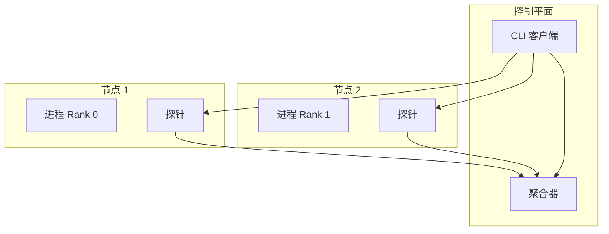

# 分布式架构

Probing 支持监控和调试跨多节点的分布式 AI 工作负载。

## 概览

分布式训练带来了挑战：

- 跨节点的多进程
- Rank 之间的通信
- 同步调试需求
- 跨节点数据关联

Probing 通过分布式架构解决这些问题。

## 架构



## 进程发现

### 本地发现

```bash
# 列出本地机器上所有启用 probing 的进程
probing list
```

### 远程发现

```bash
# 连接到远程节点
probing -t node1:8080 list
probing -t node2:8080 list
```

### 集群视图

```bash
# 列出集群视图中已注册的节点（连接到 rank 0 / master 端点）
probing -t rank0:8080 cluster nodes
```

## 跨节点查询

### 查询单个节点

```bash
probing -t node1:8080 query "
SELECT * FROM python.torch_trace
WHERE step = (SELECT MAX(step) FROM python.torch_trace)"
```

### 联邦查询（`global.*`）

跨 rank SQL 使用 **`global` catalog**。Master 向已注册节点 fan-out，并为每行附加联邦标签
**`_host`**、**`_addr`**、**`_rank`**、**`_role`**（并行角色 key，来自节点注册表，如 `dp=2,pp=1,tp=0`）。

**方式 A — SQL 引擎（分析推荐）：**

```bash
probing -t rank0:8080 query "
SELECT _role, _rank, avg(duration_ms) AS avg_ms
FROM global.python.comm_collective
WHERE global_step > 100
GROUP BY _role, _rank
ORDER BY avg_ms DESC"
```

**方式 B — cluster fan-out API：**

```bash
probing -t rank0:8080 cluster query "
SELECT _role, _rank, avg(duration_ms) AS avg_ms
FROM global.python.comm_collective
GROUP BY _role, _rank
ORDER BY avg_ms DESC"
```

通过 torchrun（`setup_torchrun_cluster`）或 `PUT /apis/nodes` 注册节点，`_rank` / `_role` 才能正确解析。训练脚本中可用 `probing.set_role(...)` 运行时覆盖 role。

引擎实现与正确性测试要求见 **[联邦查询引擎](federation.zh.md)**。

## 同步调试

### 捕获所有堆栈

```bash
# 从所有 rank 捕获堆栈跟踪
for node in node1 node2 node3; do
    echo "=== $node ==="
    probing -t $node:8080 backtrace
done
```

### 检查分布式状态

```bash
probing -t $ENDPOINT eval "
import torch.distributed as dist

if dist.is_initialized():
    print(f'Rank: {dist.get_rank()}')
    print(f'World Size: {dist.get_world_size()}')
    print(f'Backend: {dist.get_backend()}')"
```

## 通信分析

### Collective 延迟（粗粒度，内置）

`python.comm_collective` 记录 `torch.distributed` 调用墙钟时间，无需 NCCL 插件。

```sql
SELECT rank, op, avg(duration_ms) AS avg_ms, count(*) AS n
FROM python.comm_collective
WHERE global_step >= (SELECT max(global_step) - 20 FROM python.comm_collective)
GROUP BY rank, op
ORDER BY avg_ms DESC;
```

```bash
probing -t $ENDPOINT skill run slow_rank
probing -t $ENDPOINT skill run comm_bottleneck
```

### NCCL 等待分解（细粒度）

要区分 **culprit / victim**（`send_gpu_wait_ns` / `recv_wait_ns`），需启用 NCCL profiler 插件并查询 `nccl.proxy_ops`：

```bash
export NCCL_PROFILER_PLUGIN=$(python -m probing.nccl --plugin-path)
export NCCL_PROFILE_EVENT_MASK=$(python -m probing.nccl --event-mask)
export PROBING=2
# ... torchrun ...

probing -t $ENDPOINT skill run nccl_culprit_victim
probing -t $ENDPOINT query "
SELECT rank, sum(send_gpu_wait_ns) AS gpu_wait, sum(recv_wait_ns) AS recv_wait
FROM nccl.proxy_ops
GROUP BY rank
ORDER BY recv_wait DESC"
```

多机使用 `global.nccl.proxy_ops`。完整说明见 [NCCL profiler 插件](nccl-profiler.zh.md)。

### RDMA 流分析

```bash
# RDMA 特定分析
probing -t $ENDPOINT rdma
```

## 分布式问题排查

### Rank 同步

```bash
# 检查各节点 step 坐标（使用 probing step_snapshot，而非 trainer 字段）
for node in node1 node2 node3; do
    probing -t $node:8080 eval "
from probing.tracing import step_snapshot
s = step_snapshot()
print(f'rank={s.rank} local_step={s.local_step} global_step={s.global_step}')"
done
```

### 死锁检测

```bash
# 检查挂起的集合操作
probing -t $ENDPOINT query "
SELECT func, file, lineno
FROM python.backtrace
WHERE func LIKE '%collective%' OR func LIKE '%allreduce%'"
```

### 内存不均衡

```sql
-- 比较各 rank 的内存
SELECT
    rank,
    AVG(allocated) as avg_memory,
    MAX(allocated) as peak_memory
FROM python.torch_trace
GROUP BY rank;
```

## 配置

### 启用远程访问

```bash
# 以 TCP 服务器启动
PROBING_PORT=8080 python train.py

# 或动态配置
probing $ENDPOINT config probing.server.port=8080
```

### 安全

```bash
# 启用认证
PROBING_AUTH_TOKEN=secret python train.py

# 带令牌连接
probing -t host:8080 --token secret query "..."
```

## 最佳实践

### 1. 一致的配置

在所有节点上使用相同配置：

```bash
export PROBING_PORT=8080
export PROBING_TORCH_PROFILING=on
```

### 2. 集中收集

对于大型集群，考虑聚合：

```bash
# 导出数据到中心位置
probing -t $node query "SELECT * FROM python.torch_trace" >> /shared/traces.json
```

### 3. 时间戳同步

确保配置 NTP 以获得准确的跨节点时间。

### 4. 网络考虑

- 尽可能使用专用网络进行 probing 流量
- 考虑 probing 端口的防火墙规则
- 监控 probing 对训练网络的开销
