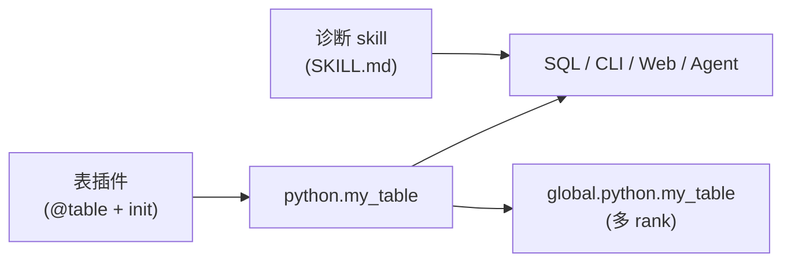

# 扩展机制

Probing 提供 **两条公开扩展路径**（另有一条可选 NCCL 插件路径）。Rust 采集器、HTTP 处理器、import hook 等属于核心内部实现。

| 路径 | 你贡献什么 | 谁在用 |
|------|------------|--------|
| **1. 表插件** | Python dataclass + `@table` | `SELECT … FROM python.*`（CLI、Web、脚本） |
| **2. 诊断 skill** | `SKILL.md` + 可选 `steps.yaml` | Agent / `probing skill run …` / Web |

**决策规则：** 要暴露**数据** → 写表插件；要贡献**怎么查** → 写 skill。



---

## 路径 1：表插件 {#path-1-table-plugin-dataclass--table}

表插件是一个 Python 模块，它：

1. 用 `@table` 声明一个或多个 **dataclass** 表
2. 运行时用 `.save()` 或 `.append()` 写行
3. 可选定义 `init()` / `deinit()` 做初始化与清理

注册后的表在 **`python` schema** 下，例如 `python.my_metrics`。分布式训练查询
**`global.python.my_metrics`** 可向各 rank fan-out（自动附加 `_host`、`_addr`、`_rank`、`_role`）。
`_role` 是来源节点的并行角色 key（如 `dp=2,pp=1,tp=0`），从 `cluster.nodes` 注册表解析——见
[分布式](distributed.zh.md)。

### 最小示例

```python
# my_plugin/__init__.py
from dataclasses import dataclass

from probing import table


@table
@dataclass
class MyMetrics:
    step: int
    loss: float


def init():
    """通过 python.enabled 加载插件时调用。"""
    MyMetrics.init_table()


def deinit():
    """通过 python.disabled 卸载时调用。"""
    MyMetrics.drop()
```

在训练代码中写数据（step 建议用 `step_snapshot()`，见 [核心概念](../guide/concepts.zh.md)）：

```python
from probing.tracing import step_snapshot

snap = step_snapshot()
MyMetrics(step=snap.local_step, loss=loss.item()).save()
```

查询：

```sql
SELECT step, avg(loss) AS avg_loss
FROM python.my_metrics
GROUP BY step
ORDER BY step;
```

参考实现：`python/probing/ext/example.py`。

### 表命名

- 默认：类名转 **snake_case**（`MyMetrics` → `my_metrics`）
- 显式：`@table("custom_name")` 写在 dataclass 上

首行写入后列类型固定。改字段需新表名，或先 `MyMetrics.drop()` 再 `init_table()`。

### `@table` 提供的 API

| 方法 | 用途 |
|------|------|
| `init_table()` | 创建或挂载 mmap 存储 |
| `save()` | 追加一行（实例方法） |
| `append(row)` / `append_many(rows)` | 类方法追加 |
| `take(n)` | 读最近 n 行（调试） |
| `drop()` | 删除表 |

存储为 probing 数据目录下的 mmap，进程崩溃后仍可被 attach 的客户端查询。

### 启用插件

设置 **`python.enabled`** 为可 import 的模块路径（与 `load_extension()` 相同）：

```bash
# 已 attach probing（PROBING=1 或 probing inject）后
probing -t <pid> config python.enabled=my_plugin

# 或通过 SQL
probing -t <pid> query "SET python.enabled='my_plugin'"
```

卸载：

```bash
probing -t <pid> config python.disabled=my_plugin
```

模块须在目标进程可 import（已安装或在 `PYTHONPATH`）。加载后 probing 调用 `init()`；禁用时调用 `deinit()`。

**另一种方式：** 在训练脚本里直接 `import my_plugin`；`@table` 在 import 时注册表；仅当需要通过 `python.enabled` 控制生命周期时才写 `init()` / `deinit()`。

### 框架集成

在插件模块内挂框架钩子，仍写入 `@table` 行：

```python
def init():
    MyMetrics.init_table()
    import torch
    torch.nn.Module.register_forward_hook(_record_module_stats)
```

官方 torch / ray 集成内部使用相同模式；第三方插件不要另建 HTTP 或独立 hook API。

### 集成示例

**Weights & Biases（桥接）**

```python
@table("wandb_run")
@dataclass
class WandbRun:
    run_id: str
    step: int
    loss: float

def init():
    WandbRun.init_table()

def on_wandb_log(step: int, loss: float):
    import wandb
    if wandb.run:
        WandbRun(run_id=wandb.run.id, step=step, loss=loss).save()
```

**自定义训练指标**

```python
@table
@dataclass
class StepStats:
    step: int
    lr: float
    grad_norm: float
```

```sql
SELECT step, lr, grad_norm
FROM python.step_stats
WHERE step > (SELECT max(step) - 100 FROM python.step_stats);
```

---

## 路径 2：诊断 skill {#path-2-diagnostic-skill}

**Skill** 打包**如何排查**的领域知识，本身不采集数据（数据用路径 1）。每个 skill 是一个目录：Agent 可读的 **`SKILL.md`**，加上可选的机器可读步骤列表（`steps.yaml`）。

内置诊断位于 `skills/<id>/`，通过 `probing skill run …` 执行。安装到 Cursor/Claude/Codex：`./skills/install.sh` 或 `probing skill install`。

### 目录结构

```
skills/
├── catalog.yaml                 # 索引（id、category、path）
└── my_check/
    ├── SKILL.md                 # 必需 — Agent + 人类可读
    ├── steps.yaml               # 可选 — 确定性 CLI 执行
    └── reference.md             # 可选 — 深入说明、外链
```

### `SKILL.md` 格式

Frontmatter 说明**何时**调用该 skill（供 Agent 路由）。正文说明**如何**思考问题。可执行步骤可写在正文或 `steps.yaml`。

```markdown
---
name: my_check
description: >
  检查 python.my_metrics 中的自定义插件指标。
  当用户询问插件数据、指标缺失或表插件计数器时使用。
category: performance
tables: [python.my_metrics]
parameters:
  limit: { type: integer, default: 20 }
---

# My check

## 何时使用

- 用户已启用表插件但图表或 SQL 结果为空
- 训练在跑但 `python.my_metrics` 无近期行

## 前置条件

在目标进程启用插件：

```bash
probing -t <pid> config python.enabled=my_plugin
```

## 步骤

1. 在 `information_schema.tables` 中确认表存在
2. 按 step 倒序取最近 `{limit}` 行
3. 若为空，提示插件未写入或未启用

## 结果解读

- `loss` 随 `step` 递增 → 插件健康
- 无行 → 检查 `python.enabled` 与训练代码是否调用 `.save()`

## 相关 skill

- `health_overview` — 不确定从哪查时先做分诊
```

### `steps.yaml`（可选，确定性执行）

存在时，CLI 与 Web Agent **不依赖 LLM 编造 SQL** 即可执行。Schema 示例：

```yaml
# skills/my_check/steps.yaml
apiVersion: probing.dev/v1
kind: Skill

metadata:
  id: my_check
  title: "检查我的插件指标"

spec:
  parameters:
    - name: limit
      type: integer
      default: 20

  steps:
    - id: recent_metrics
      title: "近期插件行"
      type: sql
      sql: |
        SELECT *
        FROM python.my_metrics
        ORDER BY step DESC
        LIMIT {limit}
      on_empty: warn
      empty_message: "无数据 — 请启用插件: python.enabled=my_plugin"

  interpretation:
    rules: []

  summary_template: |
    已检查 python.my_metrics（最近 {limit} 个 step）。
```

**SKILL.md**（知识 + 路由）与 **steps.yaml**（执行）分离：Agent 可即兴发挥，CI 与 `probing skill run` 保持可复现。

### 使用方

```bash
probing skill list
probing -t <pid> skill run my_check
probing -t <pid> skill run slow_rank --set step_window=30 --global

probing skill install    # skills/ → .cursor/.claude/.agents
./skills/install.sh
probing skill update
```

Python 工具 API（内置 skill，无需 install）：

```python
from probing.skills.tools import list_skills, run_skill
```

Web Agent 用 frontmatter 做路由（`description` + `tables`），将 `SKILL.md` 正文注入上下文；有 `steps.yaml` 时按步骤执行。

### 注册新 skill

1. 添加 `skills/my_check/SKILL.md`（必需）
2. 需要确定性执行时添加 `steps.yaml`
3. 在 `skills/catalog.yaml` 登记
4. 运行 `./skills/install.sh` 让 Agent 发现
5. 校验：`python -m probing.skills validate`

Skill 可引用**任意** SQL 表——路径 1 插件表、内置表（`cpu.utilization`、`python.torch_trace` 等）、以及多 rank 的 `global.*`。

详见 `skills/README.md`、[诊断 Skill 用户指南](../guide/skills.zh.md)、[AGENTS.md](https://github.com/DeepLink-org/probing/blob/main/AGENTS.md)。

---

## 路径 3：NCCL profiler 插件（C cdylib）

**细粒度 NCCL 等待分解**（culprit vs victim）使用 NCCL 自身加载的独立 Rust profiler，**不是** Python 表插件。

### 在训练中启用

```bash
export NCCL_PROFILER_PLUGIN=$(python -m probing.nccl --plugin-path)
export NCCL_PROFILE_EVENT_MASK=$(python -m probing.nccl --event-mask)  # 默认 26
export PROBING=2
torchrun --nproc_per_node=8 train.py
```

需要 **NCCL ≥ 2.26**（PyTorch 2.8+）。插件仅导出 `ncclProfiler_v3`，写入 mmap 表供 probing SQL 查询：

| 表 | 内容 |
|----|------|
| `nccl.proxy_ops` | 每 proxy-op 等待：`send_gpu_wait_ns`（culprit）、`recv_wait_ns`（victim）、`tp_rank`/`pp_rank`/`dp_rank` |
| `nccl.net_qp` | 可选 NetPlugin IB QP 计时（mask bit 128） |

> **与 `role` 的区别：** 训练表（`torch_trace`、`comm_collective`）用 probing **`role`** 字符串；`nccl.proxy_ops` 仍保留 NCCL 插件侧的 tp/pp/dp 列。

### 查询与诊断

```sql
SELECT rank, sum(send_gpu_wait_ns), sum(recv_wait_ns)
FROM nccl.proxy_ops
GROUP BY rank
ORDER BY 3 DESC;
```

```bash
probing -t <pid> skill run nccl_culprit_victim
```

**Culprit** rank `send_gpu_wait_ns` 高（本机 GPU 慢）；**victim** rank `recv_wait_ns` 高（等 peer/网络）。详见 [NCCL profiler 插件](nccl-profiler.zh.md)。

粗粒度 collective 延迟（`python.comm_collective`）无需该插件；`slow_rank`、`comm_bottleneck` 在表存在时会可选 JOIN `nccl.proxy_ops`。

### macOS / 无 NCCL 开发环境

```bash
PROBING=1 PROBING_NCCL_MOCK=1 python -m probing.nccl --seed-mock
```

注入合成 culprit（rank 2，高 `send_gpu_wait_ns`）与 victim（rank 5，高 `recv_wait_ns`）供 skill/SQL 测试。

### 构建

```bash
make nccl-profiler-lib   # Linux .so → python/probing/libs/
```

Crate：`probing/extensions/nccl-profiler/`。

---

## 最佳实践

### 控制行大小

每 step 写标量与小结构——不要写完整模型 state 或权重张量。

```python
# 推荐
MyMetrics(step=step, loss=float(loss)).save()

# 避免
MyMetrics(step=step, payload=model.state_dict()).save()
```

### 写入路径容错

采样钩子不应拖垮训练：

```python
def _safe_record(step: int, loss):
    try:
        MyMetrics(step=step, loss=float(loss)).save()
    except Exception:
        pass  # 或只 log 一次
```

### 推送优于拉取

在事件发生时写行（step 结束、collective 完成）。不要实现「每次 SQL 查询扫描整个进程状态」——`@table` 是 append-only 存储，不是惰性快照 API。

### 多 rank 分析用 `global.*`

```sql
-- 按并行 role 跨 rank 对齐（行内还有采集时的 role 列；_role 是联邦标签）
SELECT _role, _rank, avg(duration_ms) AS avg_ms
FROM global.python.comm_collective
WHERE global_step > 100
GROUP BY _role, _rank
ORDER BY avg_ms DESC;
```

---

## 非公开扩展 API

下列机制仅供核心开发，**第三方插件请勿依赖**：

| 机制 | 为何不公开 |
|------|------------|
| Rust `ProbeExtension` / `ProbeDataSource` | 编译进 probing；无动态插件加载 |
| `@ext_handler` / `/apis/pythonext/*` | 内部 HTTP；核心 handler 契约测试 |
| `add_module_callback` import hook | 官方 torch/ray 集成使用 |
| `probing-*` CLI 外部二进制 | 独立工具，非数据插件 |

扩展 Probing 请用 **路径 1（表插件）**、**路径 2（诊断 skill）**，或 **路径 3（NCCL profiler cdylib）** 获取细粒度 collective 等待数据。

---

## 相关文档

- [数据层](data-layer.zh.md) — `python.*` 背后的 mmap memtable
- [分布式](distributed.zh.md) — `global.*` 联邦与 cluster 查询
- [SQL 分析指南](../guide/sql-analytics.zh.md) — 查询模式
- [SQL 表目录](../reference/sql-tables.zh.md)
- [核心概念](../guide/concepts.zh.md)
- [诊断 Skill 指南](../guide/skills.zh.md)
- `skills/README.md` — skill 编写详解
- `AGENTS.md` — Agent 安装与调用
