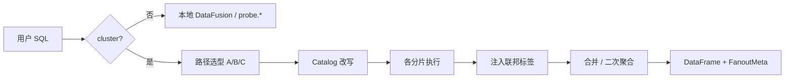
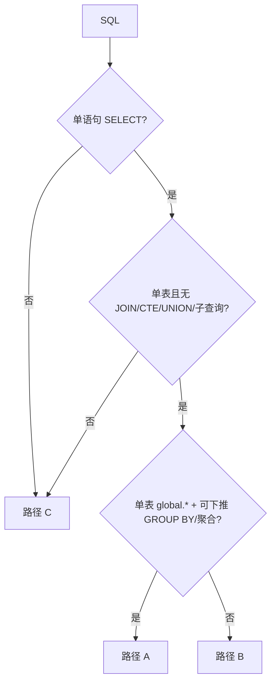

# 联邦查询引擎

**产品定位：** 在 coordinator（通常是 rank 0 / master 探针）上用 **一条 SQL** 问整个训练集群——「谁慢、慢在哪一步、是算力还是网络、是哪台机器」——而不必 SSH 逐 rank 拉日志。

**设计契约：** 本文定义用户可见语义；实现以 `probing/core/src/core/federation/` 为准，不一致时以本文推进对齐。

术语：[核心概念](../guide/concepts.zh.md) · 用法：[分布式](distributed.zh.md) · [SQL 分析](../guide/sql-analytics.zh.md)

---

## 1. 问题与原则

每个 rank 的探针 **只写本地 memtable**（`python.comm_collective`、`nccl.proxy_ops`、`python.trace_event` 等）。跨 rank 分析 = coordinator 把查询拆成：

1. 各 peer 本地执行 `probe.*`
2. HTTP fan-out 拉结果
3. 合并行并注入 **联邦标签**（标明行来自哪台机器、哪个 rank）

**原则**

| 原则 | 含义 |
|------|------|
| 本地写、按需读 | 训练路径零额外中心存储；只有显式 `cluster query` / `global.*` 才 fan-out |
| SQL 统一入口 | CLI、Web、Skill、进程内 `probing.query()` 最终都走同一套 Engine |
| 部分失败可接受 | 单个 peer 超时/不可达：丢弃该分片，返回 `nodes_failed`，不拖垮整查 |
| 不做跨 rank JOIN | 两张表要在 **同一进程** 内 join；不支持 `global.a JOIN global.b` |

**入口**

| 谁 | 怎么用 | 是否 fan-out |
|----|--------|--------------|
| 单 rank 调试 | `probing -t <pid> query "…"` | 否 |
| 集群诊断 | `probing -t rank0:8080 cluster query "…"` | 是 |
| Web Training 热力图 | `GET /apis/training/step_matrix?cluster=true` | 是 |
| 进程内 | rank 0 上 `probing.query("… global.…")` | 视 SQL |

---

## 2. 两个 Catalog 与联邦标签

### 2.1 `probe` 与 `global`

| Catalog | 含义 |
|---------|------|
| **`probe.*`** | 当前进程本地表 |
| **`global.*`** | 同一张表的 **联邦镜像**：本地 scan + 各 peer lazy fetch，合并后返回 |

用户写 `FROM python.comm_collective` 且 `cluster=true` 时，引擎 rewrite 为 `global.python.comm_collective` 再路由。

Peer 上 **永远** 执行 `probe.*`，避免递归联邦。

### 2.2 六列联邦标签（固定）

与表内 `rank`、`role` 等采集列严格区分——标签表示 **「这行是哪个探针返回的」**。

| 标签 | 含义 | 来源 |
|------|------|------|
| `_host` | 源 hostname | `cluster.nodes.host` |
| `_addr` | 探针 `host:port` | `cluster.nodes.addr` |
| `_rank` | 全局 torch rank | `RANK` |
| `_node_rank` | 节点/worker group rank | `GROUP_RANK` |
| `_local_rank` | 节点内 GPU 序号 | `LOCAL_RANK` |
| `_role` | 并行 key，如 `dp=2,pp=1,tp=0` | 注册 / `set_role` |

整型缺失 → `-1`；`_role` 缺失 → `""`。

**投影规则**

- `SELECT * FROM global.t` → 自动展开六列标签（`EXCLUDE` rewrite）
- `SELECT rank, avg_ms …` → **不**自动带标签；需要则显式写 `_rank` 等
- 标签在 **coordinator 合并时** inject，不写入 peer memtable

---

## 3. 诊断场景（用户要什么 → 用什么 SQL）

复杂问题用 **诊断链** 分步收窄，而不是一条 SQL 扫全集群 raw 行。下列场景对标生产 LLM 集群实践（[OSDI'25 Straggler / SMon](https://www.usenix.org/conference/osdi25/presentation/lin-jinkun)、[MegaScale](https://arxiv.org/pdf/2402.15627)、NCCL collective 归因），语义对齐即可，非复刻某套系统。

### 3.1 Straggler：从 rank 到机器到热力图

**链：** rank 榜 → 慢节点 → step×rank 热力图 → 按 op 分解 → NCCL culprit/victim

**① 各 rank collective 谁最慢**

```sql
SELECT _role, _rank, rank,
       avg(duration_ms) AS avg_ms, max(duration_ms) AS max_ms
FROM global.python.comm_collective
WHERE global_step >= (SELECT max(global_step) - 50 FROM global.python.comm_collective)
GROUP BY _role, _rank, rank
ORDER BY avg_ms DESC;
```

**② 慢的是整台机器还是单卡** — 按 `_host` 聚合

```sql
SELECT _host, _node_rank,
       count(DISTINCT _rank) AS ranks_on_host,
       avg(duration_ms) AS avg_comm_ms
FROM global.python.comm_collective
WHERE global_step >= (SELECT max(global_step) - 100 FROM global.python.comm_collective)
GROUP BY _host, _node_rank
ORDER BY avg_comm_ms DESC;
```

**③ Step × Rank 热力图** — Training 页矩阵；底层需同 rank 内 span JOIN

```sql
SELECT s.attributes, s.time AS start_time,
       CAST((e.time - s.time) / 1000 AS DOUBLE) AS duration_us
FROM python.trace_event s
JOIN python.trace_event e
  ON s.span_id = e.span_id AND e.record_type = 'span_end'
WHERE s.record_type = 'span_start' AND s.name = 'train.step';
```

Coordinator 聚成 `(rank, step) → duration_ms` 供 UI 着色。HTTP：`GET /apis/training/step_matrix?cluster=true`。

**④ 仅用 collective 的 step×rank long format**（前端 pivot）

```sql
SELECT global_step, _rank, _host, op, sum(duration_ms) AS comm_ms
FROM global.python.comm_collective
WHERE global_step >= (SELECT max(global_step) - 120 FROM global.python.comm_collective)
GROUP BY global_step, _rank, _host, op;
```

**⑤ NCCL：算力慢还是等网络**

```sql
SELECT seq, coll_func, _rank,
       sum(send_gpu_wait_ns) AS gpu_wait,
       sum(recv_wait_ns) AS recv_wait
FROM global.nccl.proxy_ops
WHERE seq >= (SELECT max(seq) - 50 FROM global.nccl.proxy_ops)
GROUP BY seq, coll_func, _rank;
```

### 3.2 Slowdown：job 有多慢、是持久还是偶发

对标 Byte / SMon 的 what-if：**理想 step 时间** vs **实际** 的比值。SQL 侧用 barrier proxy（非完整离散事件模拟）。

**Per-step slowdown ratio**

```sql
WITH per_rank_step AS (
  SELECT global_step, _rank, max(duration_ms) AS max_op_ms
  FROM global.python.comm_collective
  WHERE global_step >= (SELECT max(global_step) - 500 FROM global.python.comm_collective)
  GROUP BY global_step, _rank
),
step_cp AS (
  SELECT global_step,
         avg(max_op_ms) / NULLIF(min(max_op_ms), 0) AS step_slowdown_ratio
  FROM per_rank_step
  GROUP BY global_step
)
SELECT avg(step_slowdown_ratio) AS job_slowdown_proxy,
       count(*) FILTER (WHERE step_slowdown_ratio > 1.1) AS slow_steps
FROM step_cp;
```

**某 rank 是否「长期」最慢** — `worst_fraction`：在多少 step 上是最慢 rank

```sql
-- 含窗口函数；万卡规模宜拆成两步：先 A 出 per_step，再 coordinator 算
WITH per_step AS (
  SELECT global_step, _rank, _host, sum(duration_ms) AS step_ms
  FROM global.python.comm_collective
  WHERE global_step >= (SELECT max(global_step) - 300 FROM global.python.comm_collective)
  GROUP BY global_step, _rank, _host
)
SELECT _rank, _host,
       sum(CASE WHEN step_ms = max(step_ms) OVER (PARTITION BY global_step) THEN 1 ELSE 0 END)
         * 1.0 / count(*) AS worst_fraction
FROM per_step
GROUP BY _rank, _host
ORDER BY worst_fraction DESC;
```

### 3.3 并行拓扑：PP / TP / DP 与 NCCL seq

```sql
-- 按 _role 看各 step 通信量
SELECT _role, _rank, global_step, sum(duration_ms) AS comm_ms
FROM global.python.comm_collective
WHERE global_step >= (SELECT max(global_step) - 80 FROM global.python.comm_collective)
GROUP BY _role, _rank, global_step;

-- NCCL 细粒度：pp/tp/dp × seq（需 NCCL profiler 插件）
SELECT pp_rank, tp_rank, dp_rank, rank, seq, coll_func,
       sum(send_gpu_wait_ns) AS gpu_wait, sum(recv_wait_ns) AS net_wait
FROM global.nccl.proxy_ops
WHERE seq >= (SELECT max(seq) - 100 FROM global.nccl.proxy_ops)
GROUP BY pp_rank, tp_rank, dp_rank, rank, seq, coll_func;
```

### 3.4 算力 vs 通信 vs 机器资源

**Byte 结论：straggler 常来自计算而非 collective 墙钟。** 必须在 **同 rank 内** join：

```sql
SELECT c.global_step, c.rank, c.role,
       sum(c.duration_ms) AS comm_ms,
       sum(CASE WHEN t.stage LIKE 'post forward' THEN t.duration ELSE 0 END) AS compute_sec
FROM python.comm_collective c
JOIN python.torch_trace t
  ON c.global_step = t.global_step AND c.rank = t.rank AND c.role = t.role
WHERE c.global_step >= (SELECT max(global_step) - 50 FROM python.comm_collective)
GROUP BY c.global_step, c.rank, c.role;
```

Coordinator 收到各 peer 结果后，再 `GROUP BY _rank` 汇总。`comm + gpu` 对齐需 coordinator 侧 merge 两路聚合结果（v2）；暂不支持 `global.comm JOIN global.gpu`。

### 3.5 Hang 与掉队

```sql
-- 哪些 rank 的 global_step 明显落后
SELECT _host, _rank, _local_rank, max(global_step) AS last_step
FROM global.python.comm_collective
GROUP BY _host, _rank, _local_rank
HAVING max(global_step) < (SELECT max(global_step) - 5 FROM global.python.comm_collective);

-- 栈是否卡在 collective
SELECT _host, _rank, func, file, lineno
FROM global.python.backtrace
WHERE func LIKE '%collective%' OR func LIKE '%nccl%';
```

---

## 4. 引擎行为规格

本节从 §3 诊断需求反推 **引擎必须保证的用户可见语义**。实现入口：`probing/core/src/core/federation/`（执行）、`probing/server/src/server/cluster_fanout.rs`（`cluster=true` 路由）。

### 4.1 处理流水线



**统一约定**

| 项 | 语义 |
|----|------|
| 响应体 | `dataframe` + `meta.nodes_queried` + `meta.nodes_failed` |
| Peer 集合 | `cluster.nodes` 快照，**排除** coordinator 自身 listen addr |
| Peer 执行 | 永远 `probe.*`；禁止 peer 再 fan-out（防递归） |
| 并发 | 各 peer 并行请求；总延迟 ≈ 最慢 peer + coordinator 合并 |
| 超时 | 单 peer 超时记 `nodes_failed`，不拖垮整查（默认 2s，可 `PROBING_REMOTE_QUERY_TIMEOUT_SECS` 覆盖） |

### 4.2 路径选型

`cluster=false` → 仅本地，不走联邦。

`cluster=true` 时按 **AST 解析**（非 substring）依次判断：



| 路径 | 进入条件 | §3 典型场景 |
|------|----------|-------------|
| **A 聚合下推** | 单表 `global.*`；含 `GROUP BY` 和/或 `count/sum/min/max/avg`；聚合可分布式 merge | ①②④⑤、3.3 role 视图 |
| **B 联邦 scan** | 单表 `global.*`；不满足 A（无聚合、或聚合不可 merge、或含 `ORDER BY`/`LIMIT` 且 A 不接） | 拉 raw 行、带 filter 的单表探查 |
| **C broadcast** | JOIN、逗号 join、UNION、CTE、标量/IN/EXISTS 子查询、多语句、解析失败 | ③ span 热力图、3.4 compute join、3.2 含窗口的 CTE |

解析失败时 **保守走 C**（正确性优先于性能）。

### 4.3 Catalog 改写

| 阶段 | 输入 | 输出 |
|------|------|------|
| 用户 → coordinator | `python.t` / `probe.t` | `global.{schema}.t`（已知 schema：`cluster/process/files/python/memtable/gpu/rdma`） |
| 用户已写 `global.*` | 不变 | — |
| coordinator → peer | 任意 `global.*` | `probe.*`（字符串替换） |
| `SELECT *` + `global.*` | `SELECT * FROM global.t` | `SELECT * EXCLUDE (六标签), 六标签 FROM global.t` |
| 显式列清单 | `SELECT rank, avg_ms …` | **不**自动追加标签；用户需显式写 `_rank` 等 |

路径 A 生成 per-node SQL 时：**去掉** SELECT/GROUP BY 中的标签列（peer 表无标签）；coordinator merge 后再 inject。

### 4.4 联邦标签

六列固定、顺序稳定：`_host`, `_addr`, `_rank`, `_node_rank`, `_local_rank`, `_role`。

| 规则 | 说明 |
|------|------|
| 注入时机 | coordinator 收到每个分片后，**合并前**按分片来源填同一值 |
| 缺失值 | 整型标签 → `-1`；`_role` → `""` |
| 与数据列区分 | 表内 `rank`/`role` 是采集值；`_rank`/`_role` 是探针 endpoint 身份 |
| 路径一致性 | A / B / C 注入语义相同；`SELECT *` 展开顺序相同 |
| 仅按标签 GROUP BY | 如 `GROUP BY _host`：per-node 不做该 GROUP BY；coordinator 对 inject 后的 partial 再聚合 |

### 4.5 路径 A — 聚合下推

**目标：** §3 中 80% 集群诊断（榜、热力图 long format、NCCL sum）走此路径，避免万卡 raw 行上收。

**Per-node SQL 生成**

1. `FROM probe.{schema}.{table}`（由 `global.*` 改写）
2. 保留原 WHERE（整句下推）
3. SELECT 投影：去掉标签列；保留聚合表达式与非标签 GROUP BY 列
4. `GROUP BY`：仅 **数据列**（非 `_host` 等）

**Coordinator merge**

| 原聚合 | merge 函数 |
|--------|------------|
| `count`, `sum` | `sum` |
| `min` | `min` |
| `max` | `max` |
| `avg` | 不支持精确分布式 merge → **不走 A** |
| `count(distinct)` 且 GROUP BY 含数据列 | 不支持 → **不走 A** |

merge 后再 `GROUP BY` 数据列 + 用户请求的标签列（若有）。

**标签 inject：** merge 前给每个 partial 打六列；若 SELECT/GROUP BY 引用标签，coordinator merge SQL 保留这些列作 group key。

**ORDER BY / LIMIT（目标语义）**

| 子句 | 行为 |
|------|------|
| `ORDER BY` | 在 coordinator **merge 完成之后**排序；不下推到 peer |
| `LIMIT` | 在 coordinator **merge + ORDER BY 之后**截断；全局 top-K |
| 仅 `ORDER BY`/`LIMIT`、无聚合 | 不满足 A → 走路径 B 或 C |

**部分失败：** 成功 peer 的 partial 仍参与 merge；失败 addr 写入 `nodes_failed`。

### 4.6 路径 B — 联邦 scan

**目标：** 单表探查、带 filter 的 raw 采样；lazy 拉取控制 coordinator 峰值内存。

**执行模型**

| 分区 | 来源 |
|------|------|
| partition 0 | 本地 `probe.*` scan |
| partition 1..N | 每个 peer 一条 lazy partition，首次 poll 才 HTTP 拉取 |

**下推**

| 算子 | 规则 |
|------|------|
| Filter | 仅当可 **精确** 翻译为 peer SQL 的谓词才下推（schema 可解析） |
| Projection | 用户选什么列就下推什么列；标签列只在 coordinator 侧 append |
| `LIMIT` | **全局 top-K**：仅 coordinator 在合并流上截断；**不下推**到各 peer（避免每 rank 各取 K 条导致结果错误） |

**Scan 后算子：** DataFusion 在 federated scan 之上继续执行剩余计划（filter、sort、limit 等），语义以 coordinator 全局为准。

### 4.7 路径 C — broadcast

**目标：** 必须在 **同一进程 memtable** 内完成的 SQL（JOIN、CTE、窗口）。

**行为**

1. coordinator 与每个 peer 执行 **同一句** 用户 SQL（peer 侧若含 `global.*` 先改 `probe.*`）
2. 各分片独立出结果集
3. coordinator **行拼接**（列对齐，缺列填空）
4. 每个分片 inject 六列标签

**不做二次关系代数：** broadcast 结果是 concat，不在 coordinator 对两表做 join。

**万卡：** 复杂 CTE + 窗口（§3.2 `worst_fraction`）允许走 C，但产品建议 **拆诊断链**（先 A 出 per_step，再 coordinator 聚合）以控延迟与内存。

### 4.8 退化与边界

| 情况 | 行为 |
|------|------|
| 无 peer 注册 | 等同单节点；`nodes_queried=1` |
| 全部 peer 失败 | 仅本地分片（若有）；或空结果 + 正确 schema |
| 部分 peer 失败 | 合并成功分片；`nodes_failed` 列出 addr |
| 空表 | 空 DataFrame；schema 含用户请求的列 + 标签列（若适用） |
| `cluster.nodes` 与训练 rank 不一致 | 以探针注册为准；标签反映 endpoint 而非理想 torch rank |

### 4.9 明确不做

| 不做 | 原因 |
|------|------|
| `global.a JOIN global.b` | 跨 rank 无共址 join key；改用路径 C 同进程 join |
| 不可精确翻译的 filter 下推 | 避免 silent wrong results |
| 分布式 `count(distinct)` merge | 语义不可分解；fallback B/C |
| 全集群 raw + 多层 CTE 一次跑完 | 万卡内存/延迟不可控；拆 §3 诊断链 |
| Peer 递归 fan-out | HTTP 环路与放大 |

### 4.10 需求 → 路径速查

| §3 需求 | 路径 | 引擎关键点 |
|---------|------|------------|
| rank / 慢节点榜 | A | `GROUP BY _rank` / `_host`；merge + inject |
| step×rank comm 热力图 long | A | `GROUP BY global_step, _rank, _host, op` |
| span 热力图 | C | 同 rank `trace_event` self-join；concat + tag |
| job slowdown / worst_fraction | C 或 A 两步 | 窗口函数 → C；拆链后第二步 coordinator 聚合 |
| compute vs comm | C | `probe.comm JOIN probe.torch_trace`；再 `GROUP BY _rank` |
| hang / backtrace | A 或 B | 单表 `GROUP BY _rank` 或 filter raw |

---

## 5. 万卡验收（最小五连）

增强引擎时，**先保证这五条**在 mock 多节点与真 cluster 上数值正确：

| # | 场景 | 核心 SQL | 路径 |
|---|------|----------|------|
| 1 | step×rank comm 热力图 | §3.1 ④ | A |
| 2 | 慢节点榜 | §3.1 ② | A |
| 3 | job slowdown proxy | §3.2 首段 | C 或 A 两步 |
| 4 | compute vs comm | §3.4 | C + coordinator 再聚合 |
| 5 | NCCL compute/network | §3.1 ⑤ | A |

**标签：** 六列在路径 A/B/C 一致；`SELECT *` 展开顺序稳定；broadcast JOIN 与 scan 标签一致（§4.4）。

**联邦：** mock ≥2 peer 时合并行数、`_addr` 来源、`nodes_failed` 行为符合 §4.8；路径 A 的 `sum` 与 naive 全量 `GROUP BY` 一致；路径 B 的 `LIMIT` 为全局 top-K（§4.6）。

---

## 6. 相关文档

| 文档 | 内容 |
|------|------|
| [分布式架构](distributed.zh.md) | `cluster query` 用法 |
| [核心概念](../guide/concepts.zh.md) | 用户向联邦说明 |
| [SQL 表目录](../reference/sql-tables.zh.md) | 表列与 `cluster.nodes` |
| [NCCL Profiler](nccl-profiler.zh.md) | §3.1 ⑤、`nccl.proxy_ops` |
| [API — step_matrix](../api-reference.zh.md) | §3.1 ③ 热力图 |

实现模块：`probing/core/src/core/federation/` · 控制面：`probing/server/src/server/cluster_fanout.rs`
