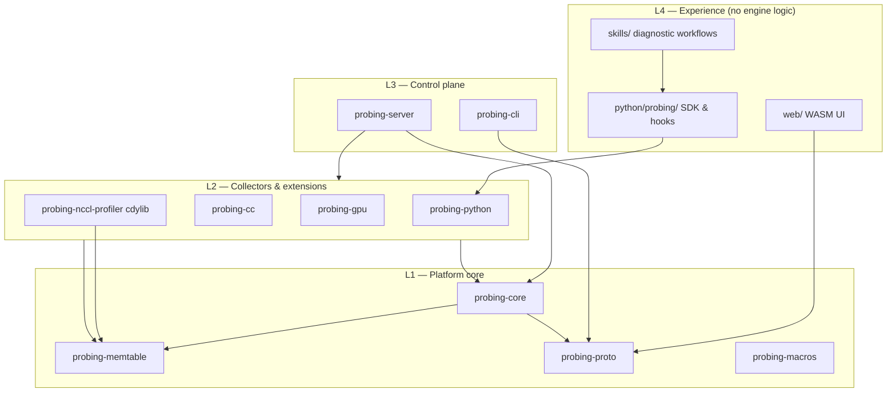
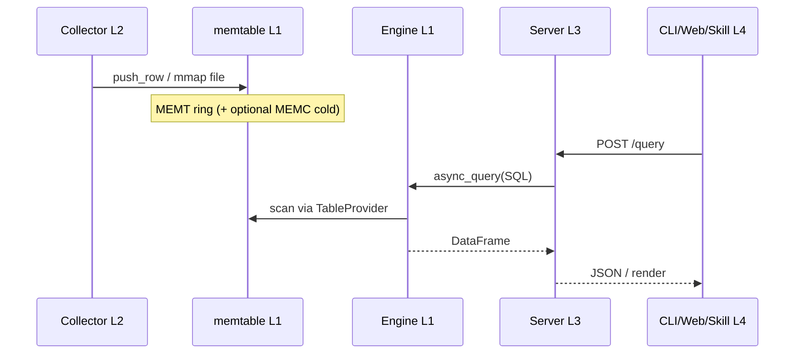

# Modularity & Module Boundaries

This document defines **core vs feature modules**, public interfaces, dependency rules, and
ownership boundaries. Goal: parallel development without cross-cutting churn.

Read with [Architecture](architecture.md), [Data Layer](data-layer.md), and
[Extensibility](extensibility.md). Shared vocabulary: [Core Concepts](../guide/concepts.md).

---

## 1. Layer model

Probing is organized in four layers. **Dependencies only flow downward** (higher layers may
call lower; never the reverse).



| Layer | Role | Changes when… |
|-------|------|----------------|
| **L1 Platform** | SQL engine, storage, wire types, plugin traits | Federation, memtable, config, catalog |
| **L2 Collectors** | Produce rows into tables; optional HTTP via Extension | New signals (GPU, NCCL, host, Python runtime) |
| **L3 Control plane** | HTTP API, CLI, composition root | New endpoints, auth, cluster fan-out |
| **L4 Experience** | UI, skills, Python integration | Diagnostics UX, hooks, agent flows |

**Composition root (only place that wires everything):**

- `probing/server/src/engine.rs` — registers all `ProbeDataSource` + `ProbeExtension` for the
  in-process server.
- Root `src/lib.rs` + `Cargo.toml` — PyO3 wheel bundles server + python extension.

---

## 2. Crate & directory map

### L1 — Platform core (stable interfaces)

| Unit | Path | Responsibility | Must NOT |
|------|------|----------------|----------|
| **probing-proto** | `probing/proto/` | `Message<T>`, `DataFrame`, `Node`, `Query` DTOs | Import core, server, extensions |
| **probing-memtable** | `probing/memtable/` | MEMT/MEMH/MEMC read/write, mmap discovery | Know SQL, HTTP, Python |
| **probing-core** | `probing/core/` | DataFusion engine, federation, config, traits | Import server, cli, extensions |
| **probing-macros** | `probing/macros/` | `#[derive(ProbeExtension)]` | Business logic |

Key core submodules:

| Submodule | Path | Contract |
|-----------|------|----------|
| Engine | `core/engine.rs` | `async_query`, `enable(ProbeDataSource)` |
| Federation | `core/federation/` | `global.*` catalog, tags `_host/_addr/_rank/_role` — see [Federated query engine](federation.md) |
| Memtable SQL | `core/memtable_sql.rs` | mmap files → `TableProvider` |
| Config | `config.rs` | `get` / `set` / `write` KV + extension options |

### L2 — Collectors (feature modules)

Each collector **writes data** and optionally **registers tables + extension config**. Collectors
do not call each other.

| Unit | Path | Schema / tables | Extension |
|------|------|-----------------|-----------|
| **probing-python** | `probing/extensions/python/` | `python.*` (backtrace, mmap tables) | `PythonExt`, `TorchProbeExtension`, `PprofProbeExtension` |
| **probing-cc** | `probing/extensions/cc/` | `cpu.*`, `cluster.nodes`, `rdma.*`, `process.*`, `files.*` | `CpuProbeExtension`, `RdmaProbeExtension` |
| **probing-gpu** | `probing/extensions/gpu/` | `gpu.utilization`, `gpu.devices` | `GpuProbeExtension` |
| **probing-nccl-profiler** | `probing/extensions/nccl-profiler/` | `nccl.proxy_ops`, `nccl.net_qp` (mmap) | NCCL plugin ABI only (no HTTP) |

Python-side collectors (same layer, different language):

| Unit | Path | Tables |
|------|------|--------|
| Torch tracing | `python/probing/profiling/` | `python.torch_trace`, `python.comm_collective` |
| Tracing spans | `python/probing/tracing/` | `python.trace_event` |
| Parallel role | `python/probing/parallel.py` | stamps `role` on rows |
| User plugins | `python/probing/ext/` | `python.<custom>` via `@table` |

### L3 — Control plane

| Unit | Path | Responsibility |
|------|------|----------------|
| **probing-server** | `probing/server/` | Axum routes, auth, `initialize_engine()`, cluster fan-out |
| **probing-cli** | `probing/cli/` | HTTP client to probe; inject/list/query/repl/**skill** |

Stable HTTP surface: `probing/server/API.md`, enforced by `tests/regression/spec/api_spec.json`.

### L4 — Experience

| Unit | Path | Responsibility |
|------|------|----------------|
| **web/** | Dioxus WASM | Pages, visualization, Investigate agent |
| **skills/** | YAML + SKILL.md | Diagnostic workflows over SQL |
| **python/probing/** | Python package | Hooks, `query()`, skills loader, nccl helper |

---

## 3. Public interfaces (contracts)

New work should extend **one** of these contracts instead of adding cross-module calls.

### 3.1 `ProbeDataSource` — register SQL tables

**Where:** `probing/core/src/core/data_source.rs`
**Register:** `EngineBuilder::with_data_source` (wired in `server/engine.rs`)

| Kind | Use when | Example |
|------|----------|---------|
| `Table` | Fixed schema, one table | `gpu.devices` |
| `Namespace` | Dynamic tables | `python.*`, mmap discovery |

**Rules:**

- Schema + scan logic live in the collector crate.
- Federation: table names under known schemas (`python`, `nccl`, `gpu`, …) auto-mirror to
  `global.<schema>.<table>`.
- Do **not** query other collectors from inside `scan()`; join at SQL layer.

### 3.2 `ProbeExtension` — config + imperative HTTP

**Where:** `probing/core/src/core/probe_extension.rs`
**Derive:** `#[derive(ProbeExtension)]` in `probing-macros`

| Capability | Mechanism |
|------------|-----------|
| Config keys | `probing.<namespace>.<option>` via `set` / `get` / `options` |
| Side effects | Background sampler start/stop in `set_*` handlers |
| HTTP | `ProbeExtensionCall::call` → `/apis/<name>/...` fallback |

**Rules:**

- Extension name = URL segment (`pythonext`, `rdmaextension`, …).
- Prefer **tables for data**, extension for **control** (start/stop, eval, flamegraph render).
- Never `todo!()` in default trait methods — return `EngineError`.

### 3.3 Python `@table` — application data plugins

**Where:** `python/probing/core/table.py`, documented in [Extensibility](extensibility.md)

```python
@table("comm_collective")
@dataclass
class CommCollective: ...
```

**Rules:**

- Writes go through memtable mmap → appear as `python.<name>`.
- Stamp `local_step`, `global_step`, `rank`, `role` on training rows (see
  [concepts](../guide/concepts.md)).
- No direct Rust imports from Python plugins.

### 3.4 Skill contract — diagnostic workflows

**Where:** `skills/<id>/SKILL.md` + `steps.yaml`, catalog `skills/catalog.yaml`

| Field | Purpose |
|-------|---------|
| `requires.any_tables` | Preconditions |
| `spec.steps[].sql` | Evidence queries (only interface to engine) |
| `interpretation.rules` | Deterministic findings |
| `next_steps` | Hand-off to other skills |

**Rules:**

- Skills **only** talk to the engine via SQL (`probing query`) or documented HTTP APIs.
- No Rust/Python code in skills — YAML + markdown only.
- CLI (`probing/cli/skill/`), Python (`python/probing/skills/`), Web (`web/src/agent/skill.rs`)
  are **loaders**; skill content is single source in `skills/`.

### 3.5 Wire protocol — CLI / Web ↔ Server

**Where:** `probing/proto/`

| Endpoint | Payload |
|----------|---------|
| `POST /query` | `Message<Query>` → `Message<Data>` |
| `POST /query/dto` | Stable external DTO |
| `GET /apis/*` | JSON / SVG per API.md |
| `GET /ws` | REPL |

**Rules:**

- CLI and Web must not link `probing-core` at runtime (CLI: proto only; Web: HTTP + proto types).
- Breaking API changes require `api_spec.json` + contract tests update.

### 3.6 Federation tags

**Where:** `probing/core/src/core/federation/convert.rs`

Every `global.*` row adds:

| Column | Source |
|--------|--------|
| `_host` | Peer hostname |
| `_addr` | Peer `host:port` |
| `_rank` | `torch.distributed` rank from node registry |
| `_role` | Parallel role key from node registry |

Collectors must not invent alternate peer tags.

---

## 4. Dependency rules

```text
Allowed:
  L4 → L3 (HTTP only)
  L3 → L2, L1
  L2 → L1
  L1 internal: core → memtable, proto

Forbidden (fix if found):
  L1 → L2/L3/L4
  L2 → L2 (collector cross-deps)
  L2 → L3 (extensions must not import server)
  L2 → probing-cli  — **packaging only** (see §4.1; not a runtime collector→control violation)
  skills → Rust internals
  web → probing-core / pyo3
```

### Dependency matrix (target state)

|  | proto | memtable | core | cc/gpu/py | server | cli |
|--|:-----:|:--------:|:----:|:---------:|:------:|:---:|
| **proto** | — | | | | | |
| **memtable** | | — | | | | |
| **core** | ✓ | ✓ | — | | | |
| **extensions** | ✓ | ✓ | ✓ | — | | |
| **server** | ✓ | ✓ | ✓ | ✓ | — | |
| **cli** | ✓ | opt | | | | — |
| **web** | ✓ | | | | | |

### 4.1 PyPI packaging coupling (`probing-python` → `probing-cli`)

Maturin builds **one native artifact** (`probing._core` cdylib from root `Cargo.toml`). The
`probing` console script is **not** a separate Rust binary on PyPI:

```text
pip install probing
  → probing._core.so   (core + server + python ext + cli linked in)
  → probing.cli.__main__  →  _core.cli_main()  →  probing_cli::cli_main()
```

This is an **accepted compile-time coupling** for the wheel workflow (`pyproject.toml`
`[tool.maturin]` + `[project.scripts]`). It is **not** the Python collector calling the CLI
control plane at runtime for data paths.

**Contract (keep the edge thin):**

- `probing-python` may depend on `probing-cli` **only** to re-export `cli_main` in
  `features/python_api.rs` for the PyO3 entrypoint.
- Do **not** import other `probing-cli` modules (inject, skill runner internals, ctrl) from
  collectors or server.
- Standalone Rust binary (`probing/cli/src/main.rs`) remains optional for non-PyPI installs;
  PyPI users always go through the Python script entry.

If CLI logic grows, split **`probing-cli-lib`** (shared `cli_main` + HTTP client) from CLI-only
commands, rather than letting `probing-python` spread imports across the cli crate.

---



**Implications:**

- New metrics → new table (or new columns with new table name), not ad-hoc server state.
- Cross-signal analysis → SQL JOIN or skill steps, not collector callbacks.
- Hot/cold retention → memtable + `MemTableProbeExtension` config only.

---

## 6. Module boundaries by concern

Use this table to decide **where a change belongs**:

| Concern | Owner module | Interface |
|---------|--------------|-----------|
| SQL parsing, federation rewrite | probing-core | `Engine::async_query` |
| mmap format, compaction | probing-memtable | `RowWriter`, `ColdStore` |
| Mixed Python/C stack | probing-python/features | `python.backtrace`, pprof |
| Torch module sampling | python/probing/profiling | `python.torch_trace` |
| Collective wall time | python/probing/profiling/collective | `python.comm_collective` |
| NCCL wait decomposition | probing-nccl-profiler | `nccl.proxy_ops` |
| Host CPU / RDMA counters | probing-cc | `cpu.*`, `rdma.*` |
| GPU mem / util | probing-gpu | `gpu.*` |
| Cluster node registry | probing-core/cluster + server/report | `cluster.nodes`, PUT/GET `/apis/nodes` |
| Cross-rank fan-out | probing-server/cluster_fanout | `global.*`, `/apis/cluster/query` |
| Auth, request limits | probing-server | middleware |
| Inject, query CLI | probing-cli | HTTP to server |
| Diagnostic skills | skills/ | steps.yaml |
| Training step matrix UI | web/pages/training | GET `/apis/training/step_matrix` |
| Agent routing | web/agent + skills catalog | skill metadata |

---

## 7. Team ownership (suggested)

| Area | Paths | Can merge without |
|------|-------|-------------------|
| **Platform** | `probing/core`, `probing/memtable`, `probing/proto`, `probing/macros` | Touching collectors |
| **Host/GPU** | `probing/extensions/cc`, `probing/extensions/gpu` | Python, web |
| **Runtime Python** | `probing/extensions/python`, `python/probing/profiling`, `python/probing/tracing` | NCCL plugin, web pages |
| **NCCL** | `probing/extensions/nccl-profiler`, `python/probing/nccl` | Torch hooks |
| **Control plane** | `probing/server`, `probing/cli` | Skill content, web UI |
| **Diagnostics** | `skills/`, `probing/cli/skill`, `web/src/agent` | Collector internals |
| **Web UI** | `web/` (except agent skill loader) | Rust collectors |
| **Docs** | `docs/` | — |

**Merge checklist:**

1. Does it respect dependency direction (§4)?
2. If adding a table → `ProbeDataSource` or `@table` only?
3. If adding diagnostics → skill step or new table, not server one-off?
4. HTTP change → `API.md` + `api_spec.json`?
5. Federation → uses standard tags only?

---

## 8. Known boundary violations (technical debt)

Track and fix incrementally:

| Issue | Current | Target |
|-------|---------|--------|
| Python ext → CLI | `probing-python` → `probing-cli` | **Accepted** for maturin wheel (`cli_main` only); keep import surface minimal |
| Server → python `features/*` | ~~`server/profiling.rs`~~ removed | Flamegraphs via `torchextension` / `pprofextension` `ProbeExtensionCall` |
| Server → python REPL internals | ~~`PythonRepl` in server~~ | `/ws` uses `ReplSession` facade only |
| Composition sprawl | All wiring in `server/engine.rs` | Optional: manifest TOML listing enabled extensions |
| Skills triple loader | Rust + Python + Web embed `skills/` | Keep `skills/` SSOT; loaders versioned together in CI |
| kmsg collector | Registered (Linux/kmsg feature gate) | Done |
| Architecture doc | 2-layer diagram | Superseded by this doc + [Data Layer](data-layer.md) |

---

## 9. Adding a new feature (decision tree)

```text
Need new raw signals?
  └─ Yes → L2 collector
        ├─ System/host/GPU/NCCL → Rust extension crate
        └─ Training semantics → Python @table + hook in python/probing/
  └─ No
        Need new analysis workflow?
          └─ Yes → L4 skill (steps.yaml) referencing existing tables
        Need new UI?
          └─ Yes → L4 web page calling existing HTTP/SQL
        Need new transport/command?
          └─ Yes → L3 CLI + server endpoint (proto DTO first)
```

**Anti-patterns:**

- Adding business logic to `server/engine.rs` beyond registration.
- Web page importing SQL strings for tables that don't exist in catalog.
- Collector calling `Engine::async_query` from write path.
- Skill embedding one-off Rust code paths.

---

## 10. Related documents

| Doc | Scope |
|-----|-------|
| [Architecture](architecture.md) | Historical overview (being aligned with this doc) |
| [Data Layer](data-layer.md) | MEMT/MEMC internals |
| [Extensibility](extensibility.md) | Public extension paths (table + skill) |
| [Distributed](distributed.md) | Federation & cluster |
| [NCCL Profiler](nccl-profiler.md) | NCCL plugin boundary |
| [web/DESIGN.md](https://github.com/DeepLink-org/probing/blob/main/web/DESIGN.md) | UI module layout |
| [AGENTS.md](https://github.com/DeepLink-org/probing/blob/main/AGENTS.md) | Agent skill usage |
