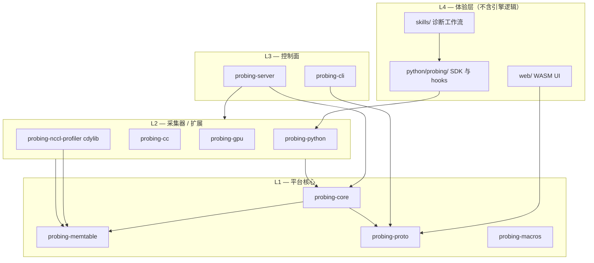
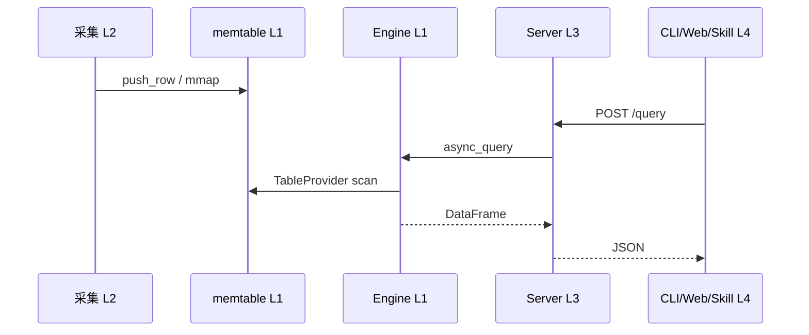

# 模块化与边界

本文定义 **核心模块 vs 功能模块**、公共接口、依赖规则与建议 ownership，目标是让并行开发**互不打扰**。

配合阅读：[系统架构](architecture.zh.md)、[数据层](data-layer.zh.md)、[扩展机制](extensibility.zh.md)；术语见 [核心概念](../guide/concepts.zh.md)。

---

## 1. 分层模型

Probing 分四层。**依赖只能向下**（上层可调用下层，反之禁止）。



| 层 | 职责 | 典型变更 |
|----|------|----------|
| **L1 平台** | SQL 引擎、存储、协议、插件 trait | federation、memtable、config |
| **L2 采集** | 写表 + 可选 Extension 控制 | GPU、NCCL、主机、Python 运行时 |
| **L3 控制面** | HTTP、CLI、组装根 | 新 endpoint、认证、cluster fan-out |
| **L4 体验** | UI、skills、Python 集成 | 诊断 UX、Agent、hooks |

**组装根（唯一允许「把所有模块接在一起」的地方）：**

- `probing/server/src/engine.rs` — 注册全部 `ProbeDataSource` + `ProbeExtension`
- 根目录 `src/lib.rs` + `Cargo.toml` — wheel 打包 server + python 扩展

---

## 2. Crate 与目录对照

### L1 — 平台核心（接口应稳定）

| 单元 | 路径 | 职责 | 禁止 |
|------|------|------|------|
| **probing-proto** | `probing/proto/` | 消息、DataFrame、Node、Query DTO | 依赖 core/server/扩展 |
| **probing-memtable** | `probing/memtable/` | MEMT/MEMH/MEMC、mmap 发现 | 感知 SQL/HTTP/Python |
| **probing-core** | `probing/core/` | DataFusion、federation、config、trait | 依赖 server/cli/扩展 |
| **probing-macros** | `probing/macros/` | `ProbeExtension` 派生宏 | 业务逻辑 |

核心子模块：

| 子模块 | 路径 | 契约 |
|--------|------|------|
| Engine | `core/engine.rs` | `async_query`、`enable(ProbeDataSource)` |
| Federation | `core/federation/` | `global.*`、六列联邦标签 — [联邦查询引擎](federation.zh.md) |
| Memtable SQL | `core/memtable_sql.rs` | mmap → `TableProvider` |
| Config | `config.rs` | KV + extension options |

### L2 — 采集器（功能模块）

各采集器**只写数据**，彼此**不互相调用**。

| 单元 | 路径 | 表 / schema | Extension |
|------|------|-------------|-----------|
| **probing-python** | `probing/extensions/python/` | `python.*` | PythonExt、Torch、Pprof |
| **probing-cc** | `probing/extensions/cc/` | `cpu.*`、`cluster.nodes`、`rdma.*`… | Cpu、Rdma |
| **probing-gpu** | `probing/extensions/gpu/` | `gpu.*` | Gpu |
| **probing-nccl-profiler** | `probing/extensions/nccl-profiler/` | `nccl.proxy_ops`、`nccl.net_qp` | 仅 NCCL ABI |

Python 侧采集（同层，不同语言）：

| 单元 | 路径 | 表 |
|------|------|-----|
| Torch | `python/probing/profiling/` | `torch_trace`、`comm_collective` |
| Span | `python/probing/tracing/` | `trace_event` |
| 并行 role | `python/probing/parallel.py` | 写入 `role` 列 |
| 用户插件 | `python/probing/ext/` | `@table` → `python.*` |

### L3 — 控制面

| 单元 | 路径 | 职责 |
|------|------|------|
| **probing-server** | `probing/server/` | 路由、认证、`initialize_engine()`、fan-out |
| **probing-cli** | `probing/cli/` | HTTP 客户端；inject/query/repl/**skill** |

HTTP 契约：`probing/server/API.md` + `tests/regression/spec/api_spec.json`。

### L4 — 体验层

| 单元 | 路径 | 职责 |
|------|------|------|
| **web/** | Dioxus | 页面、可视化、Investigate Agent |
| **skills/** | YAML + SKILL.md | 基于 SQL 的诊断流程 |
| **python/probing/** | Python 包 | hooks、`query()`、skills 加载 |

---

## 3. 公共接口（契约）

新功能应**扩展下列契约之一**，而不是新增跨模块直连。

### 3.1 `ProbeDataSource` — 注册 SQL 表

**定义：** `probing/core/src/core/data_source.rs`
**注册：** `EngineBuilder::with_data_source`（在 `server/engine.rs` 接线）

| 类型 | 场景 | 示例 |
|------|------|------|
| `Table` | 固定 schema | `gpu.devices` |
| `Namespace` | 动态表 | `python.*`、mmap 发现 |

**规则：** schema/scan 在采集 crate 内；跨信号用 SQL JOIN，不在 `scan()` 里调别的采集器。

### 3.2 `ProbeExtension` — 配置 + 命令式 HTTP

**定义：** `probing/core/src/core/probe_extension.rs`

| 能力 | 机制 |
|------|------|
| 配置 | `probing.<ns>.<option>` |
| 副作用 | `set_*` 里启停采样线程 |
| HTTP | `/apis/<name>/...` |

**规则：** 数据走表，控制走 Extension；trait 默认实现禁止 `todo!()`。

### 3.3 Python `@table` — 应用数据插件

见 [扩展机制](extensibility.zh.md)。训练行应带 `local_step`、`global_step`、`rank`、`role`（见 [核心概念](../guide/concepts.zh.md)）。

### 3.4 Skill 契约 — 诊断工作流

**SSOT：** `skills/<id>/` + `skills/catalog.yaml`

| 字段 | 作用 |
|------|------|
| `requires.any_tables` | 前置条件 |
| `spec.steps[].sql` | 唯一引擎接口 |
| `interpretation.rules` | 确定性结论 |
| `next_steps` | 技能链 |

**规则：** Skill 只通过 SQL / 文档化 HTTP 访问数据；**不含 Rust/Python 业务代码**。
CLI、Python loader、Web agent 都是**加载器**，内容以 `skills/` 为准。

### 3.5 线协议 — CLI / Web ↔ Server

**定义：** `probing/proto/`

| Endpoint | 载荷 |
|----------|------|
| `POST /query` | `Message<Query>` → `Message<Data>` |
| `POST /query/dto` | 稳定外部 DTO |
| `GET /apis/*` | 按 API.md 返回 JSON / SVG |
| `GET /ws` | REPL |

**规则：** CLI / Web 运行时不得链接 `probing-core`（CLI 仅 proto；Web 仅 HTTP + proto 类型）。破坏性 API 变更须同步 `api_spec.json` 与契约测试。

### 3.6 Federation 标签（固定，勿自创）

| 列 | 含义 |
|----|------|
| `_host` | 对端主机 |
| `_addr` | 对端地址 |
| `_rank` | torch rank |
| `_role` | 并行 role key |

---

## 4. 依赖规则

```text
允许：L4→L3(HTTP) → L3→L2/L1 → L2→L1

禁止：
  L1 → 上层
  L2 ↔ L2（采集器互调）
  L2 → server / cli
  probing-python → probing-cli  — **打包耦合**（见 §4.1，非运行时采集→控制面）
  skills → Rust 内部
  web → probing-core
```

### 依赖矩阵（目标态）

|  | proto | memtable | core | cc/gpu/py | server | cli |
|--|:-----:|:--------:|:----:|:---------:|:------:|:---:|
| **proto** | — | | | | | |
| **memtable** | | — | | | | |
| **core** | ✓ | ✓ | — | | | |
| **extensions** | ✓ | ✓ | ✓ | — | | |
| **server** | ✓ | ✓ | ✓ | ✓ | — | |
| **cli** | ✓ | opt | | | | — |
| **web** | ✓ | | | | | |

### 4.1 PyPI 打包耦合（`probing-python` → `probing-cli`）

Maturin 只构建 **一个 native 产物**（根 `Cargo.toml` 的 `probing._core` cdylib）。PyPI 上的
`probing` 命令 **不是** 独立 Rust 二进制：

```text
pip install probing
  → probing._core.so   （core + server + python ext + cli 链进同一 .so）
  → probing.cli.__main__  →  _core.cli_main()  →  probing_cli::cli_main()
```

这是为适配 maturin wheel 工作流（`pyproject.toml` 的 `[tool.maturin]` +
`[project.scripts]`）的 **可接受编译期耦合**，不是采集器在运行时反向调用控制面。

**契约（保持边界薄）：**

- `probing-python` 依赖 `probing-cli` **仅** 用于在 `python_api.rs` 暴露 `cli_main` 给 PyO3。
- **禁止** 从采集器/server 引用 cli 的 inject、skill 内部、ctrl 等模块。
- 非 PyPI 安装仍可选用独立 Rust binary（`cli/src/main.rs`）；PyPI 用户走 Python 入口。

若 CLI 继续膨胀，可拆 **`probing-cli-lib`**（共享 `cli_main` + HTTP 客户端），而不是让
python ext 扩散 import cli crate 内部。

---



**推论：** 新指标 → 新表；跨信号分析 → SQL 或 skill； retention 只动 memtable 配置。

---

## 6. 按关注点划界

| 关注点 | 归属 | 接口 |
|--------|------|------|
| SQL 解析、federation 重写 | probing-core | `Engine::async_query` |
| mmap 格式、冷压缩 | probing-memtable | `RowWriter`, `ColdStore` |
| 混合 Python/C 栈 | probing-python/features | `python.backtrace`、pprof |
| Torch 模块采样 | python/profiling | `python.torch_trace` |
| Collective 墙钟 | python/profiling/collective | `python.comm_collective` |
| NCCL wait 分解 | nccl-profiler | `nccl.proxy_ops` |
| 主机 CPU / RDMA | probing-cc | `cpu.*`, `rdma.*` |
| GPU 显存 / 利用率 | probing-gpu | `gpu.*` |
| 集群节点注册 | core/cluster + server/report | `cluster.nodes`、`PUT/GET /apis/nodes` |
| 跨 rank fan-out | server/cluster_fanout | `global.*`、`/apis/cluster/query` |
| 认证、限流 | probing-server | middleware |
| inject、query CLI | probing-cli | HTTP → server |
| 诊断 skill | skills/ | steps.yaml |
| Training step 矩阵 UI | web/pages/training | `GET /apis/training/step_matrix` |
| Agent 路由 | web/agent + skills catalog | skill 元数据 |

---

## 7. 建议 Ownership

| 团队域 | 路径 | 可独立演进 |
|--------|------|------------|
| **平台** | core, memtable, proto, macros | 不碰采集器 |
| **主机/GPU** | extensions/cc, extensions/gpu | 不碰 Python/web |
| **运行时 Python** | extensions/python, python/probing/profiling | 不碰 NCCL 插件 |
| **NCCL** | nccl-profiler, python/nccl | 不碰 Torch hooks |
| **控制面** | server, cli | 不碰 skill 内容 |
| **诊断** | skills/, cli/skill, web/agent | 不碰采集内部 |
| **Web UI** | web/（agent loader 除外） | 不碰 Rust 采集 |

**合入前自检：**

1. 依赖方向是否正确？
2. 新数据是否只通过表 / `@table`？
3. 新诊断是否只加 skill，而非 server 特例？
4. HTTP 变更是否更新 API.md + api_spec？
5. Federation 是否只用标准标签？

---

## 8. 已知边界违规（技术债）

| 问题 | 现状 | 目标 |
|------|------|------|
| python → cli | `probing-python` → `probing-cli` | **可接受**（maturin wheel，仅 `cli_main`）；禁止扩散 import |
| server → python features | ~~`server/profiling.rs`~~ 已删 | 火焰图走 Extension |
| server → REPL 内部 | ~~`PythonRepl`~~ | `/ws` 仅用 `ReplSession` 门面 |
| 组装集中 | 全在 server/engine.rs | 可选 extension manifest |
| Skill 三份 loader | Rust/Python/Web | `skills/` 为 SSOT，CI 同步校验 |
| kmsg 采集器 | 已实现未注册 | 在 engine 注册或删除 |
| Architecture 文档 | 二层旧图 | 以本文 + [数据层](data-layer.zh.md) 为准 |

---

## 9. 新功能决策树

```text
要新原始信号？
  └─ 是 → L2 采集
        ├─ 系统/GPU/NCCL → Rust extension
        └─ 训练语义 → Python @table + hook
  └─ 否
        要新分析流程？ → L4 skill（仅 SQL）
        要新 UI？ → L4 web（仅 HTTP/SQL）
        要新命令？ → L3 CLI + proto DTO
```

**反模式：** 在 engine.rs 写业务；Web 查不存在的表；采集器在写路径里 query；Skill 内嵌 Rust 分支。

---

## 10. 相关文档

| 文档 | 范围 |
|------|------|
| [系统架构](architecture.zh.md) | 历史概览（逐步与本页对齐） |
| [数据层](data-layer.zh.md) | MEMT/MEMC 内部实现 |
| [扩展机制](extensibility.zh.md) | 对外扩展路径（表 + skill + NCCL） |
| [分布式](distributed.zh.md) | 联邦与集群 |
| [NCCL Profiler](nccl-profiler.zh.md) | NCCL 插件边界 |
| [web/DESIGN.md](https://github.com/DeepLink-org/probing/blob/main/web/DESIGN.md) | 前端模块布局 |
| [AGENTS.md](https://github.com/DeepLink-org/probing/blob/main/AGENTS.md) | Agent 使用 skill |
