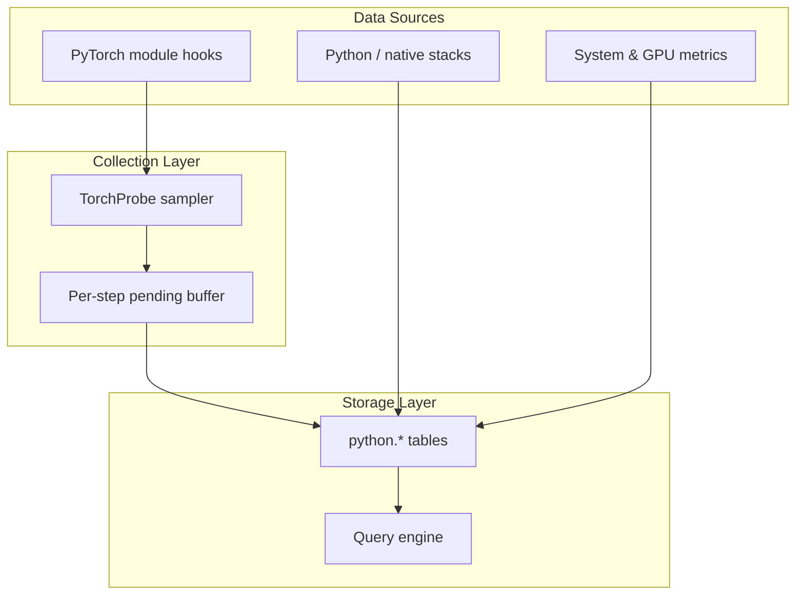

# Profiling Implementation

Probing provides profiling capabilities for AI workloads with minimal overhead and SQL-queryable storage.

## Overview

The profiling system collects performance data through:

- Hook-based and periodic collectors
- Statistical sampling (long-running telemetry, not episodic trace windows)
- Columnar table storage (memtable / Arrow-backed tables)
- SQL query interface

## Data Collection Architecture



## PyTorch Profiling (TorchProbe)

### Design

TorchProbe targets **always-on, module-level training telemetry** after probe injection or `PROBING_TORCH_PROFILING=on`. It is complementary to episodic tools such as `torch.profiler` / Kineto (op/kernel Chrome traces).

There is **no warmup schedule API**. Skip cold-start steps in SQL when needed:

```sql
SELECT * FROM python.torch_trace WHERE step > 10;
```

### Hooks

By default, Probing installs:

- Forward pre/post hooks on every `nn.Module` in the model tree
- Optimizer pre/post step hooks

**Backward hooks are not enabled by default.** Module backward hooks can alter autograd behaviour and have caused execution errors in production; forward-only collection is the safe default. Backward hooks remain available via `install_hooks(..., backward=True)` for controlled experiments.

### Sampling

The first complete training step is **discovery**: modules are registered, no rows are written. Sampling begins on subsequent steps.

| Mode | `rate` meaning |
|------|----------------|
| `ordered` (default) | Probability each step is sampled. On sampled steps, one module rotates per step (`curr_mod`), plus a per-step **time anchor** at hook offset `0` (first hook in the step). |
| `random` | Every step is sampled. `rate` is the per-hook probability for offset `> 0`. The offset `0` anchor is always recorded. |

Hook overhead is reduced by sampling; forward hooks remain registered on all modules.

Records are flushed at the end of each optimizer step (after optional GPU `synchronize()`). Pre/post hook pairs produce two rows; **duration is set on the post row** (`post forward`, `post step`, etc.).

### Collected Data (`python.torch_trace`)

Full column list: [SQL Tables — torch_trace](../reference/sql-tables.md#python-torch_trace).

| Field | Type | Description |
|-------|------|-------------|
| step | int | Local training step (per rank) |
| global_step | int | Global step (`step_snapshot`) |
| rank | int | `torch.distributed` rank |
| world_size | int | World size |
| role | string | Parallel role key, e.g. `dp=2,pp=1,tp=0` |
| seq | int | Hook sequence within step |
| module | string | Module name |
| stage | string | `pre forward`, `post forward`, `pre step`, `post step` (backward not collected by default) |
| allocated | float | GPU memory allocated (MB); CUDA only |
| max_allocated | float | Peak GPU memory (MB) |
| cached | float | GPU memory reserved (MB) |
| max_cached | float | Peak reserved (MB) |
| time_offset | float | Seconds since step anchor |
| duration | float | Stage duration (seconds); meaningful on post rows |

Use `role` + `global_step` to join with `python.comm_collective` on the same rank.

### Collective rows (`python.comm_collective`)

Lite-mode hooks on `torch.distributed` write one row per collective with `duration_ms`,
`bytes`, `op`, and the same step/role coordinates. See [SQL Tables](../reference/sql-tables.md#python-comm_collective) and [SQL Analytics](../guide/sql-analytics.md#python-comm_collective).

### Enable PyTorch Profiling

```bash
# Environment variable (synced to probing.torch.profiling)
PROBING_TORCH_PROFILING=on python train.py

# Ordered sampling, 50% of steps
PROBING_TORCH_PROFILING=ordered:0.5 python train.py

# Random per-hook sampling
PROBING_TORCH_PROFILING=random:0.1,tracepy=on python train.py
```

Programmatic configuration:

```python
from probing.profiling.torch_probe import configure

configure("on,mode=ordered,rate=0.5")
```

Profiling starts on the first `optimizer.step()` after torch is imported (optimizer post hook).

## Python Stack Profiling

### Backtrace Collection

On-demand or periodic stack capture (SIGUSR2 / synchronous walk) into `python.backtrace`:

- Function names, file paths, line numbers
- Python and native frames (merged where possible)

CPU sampling via pprof (`probing.pprof.sample_freq`) is separate from TorchProbe module hooks.

## System Metrics

Host CPU, memory, GPU utilization, and related metrics are collected on configurable intervals via environment variables such as `PROBING_GPU_SAMPLE_MS`.

## Data Storage

Torch traces and other probe data are stored in **columnar probe tables** (e.g. `python.torch_trace`), queryable through the engine. Retention and federation follow memtable / server configuration—not a fixed-size in-process ring buffer.

## Query Interface

```sql
-- Skip discovery / warm-up steps
SELECT module, stage, AVG(duration) AS avg_sec
FROM python.torch_trace
WHERE step > 1 AND duration > 0
GROUP BY module, stage
ORDER BY avg_sec DESC;

-- Per-module flamegraph input uses median(duration) on post rows
SELECT module, stage, median(CAST(duration AS DOUBLE))
FROM python.torch_trace
WHERE module <> 'None' AND stage LIKE 'post %'
GROUP BY module, stage;
```

## Performance Overhead

Overhead depends on model size (all modules carry forward hooks), sampling mode/rate, and optional features (`sync`, `tracepy`, variable watch). Use lower `rate`, disable torch profiling when not needed, and filter early steps in SQL rather than adding a warmup schedule.

| Scenario | Typical impact |
|----------|----------------|
| Torch profiling off | Baseline probe overhead only |
| `ordered:0.1` | Low; most steps skipped |
| `ordered:1.0` | Moderate; one module + anchor per step |
| `sync=on` | Higher; synchronizes GPU each hook |
