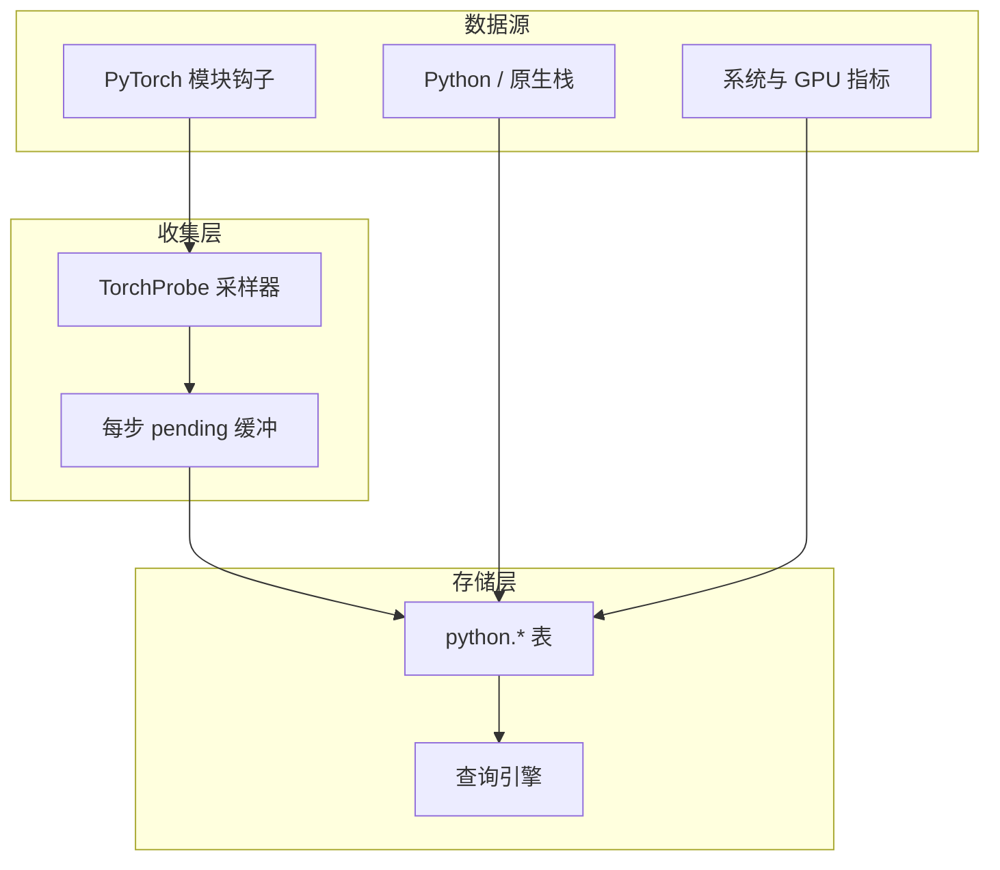

# 性能分析实现

Probing 为 AI 工作负载提供低开销、可 SQL 查询的性能数据采集能力。

## 概览

性能分析系统通过以下方式收集数据：

- 基于钩子与周期性的采集器
- 统计采样（长期遥测，而非短时 trace 窗口）
- 列式表存储（memtable / Arrow 表）
- SQL 查询接口

## 数据收集架构



## PyTorch 分析（TorchProbe）

### 设计定位

TorchProbe 面向**注入后长期开启的 module 级训练遥测**（`PROBING_TORCH_PROFILING=on`）。与 episodic 工具（`torch.profiler` / Kineto 的 op/kernel Chrome trace）互补，而非替代。

**不提供 warmup schedule API**。跳过冷启动步请在 SQL 中过滤：

```sql
SELECT * FROM python.torch_trace WHERE step > 10;
```

### 钩子

默认安装：

- 模型树上每个 `nn.Module` 的 forward pre/post 钩子
- Optimizer 的 pre/post step 钩子

**默认不启用 backward 钩子。** 模块级 backward 钩子可能改变 autograd 行为并导致执行错误；生产环境以仅 forward 为安全默认。实验场景可通过 `install_hooks(..., backward=True)` 手动开启。

### 采样策略

第一个完整训练 step 为 **discovery**：只注册模块，不写库。从后续 step 开始采样。

| 模式 | `rate` 含义 |
|------|-------------|
| `ordered`（默认） | 每个训练 step 被采样的概率。被采样的 step 内轮转一个模块（`curr_mod`），并在 hook offset `0`（本 step 第一个钩子）记录**时间锚点**。 |
| `random` | 每个 step 都会采样。`rate` 作用于 offset `> 0` 的钩子；offset `0` 锚点始终记录。 |

采样降低记录开销；forward 钩子仍挂在全部子模块上。

记录在每个 optimizer step 结束时批量落盘（可选 GPU `synchronize()`）。pre/post 成对产生两行；**时长在 post 行**（`post forward`、`post step` 等）上有效。

### 采集字段（`python.torch_trace`）

完整列说明：[SQL 表 — torch_trace](../reference/sql-tables.zh.md#python-torch_trace)。

| 字段 | 类型 | 描述 |
|------|------|------|
| step | int | 本地训练步（每 rank） |
| global_step | int | 全局步（`step_snapshot`） |
| rank | int | `torch.distributed` rank |
| world_size | int | world size |
| role | string | 并行角色 key，如 `dp=2,pp=1,tp=0` |
| seq | int | step 内钩子序号 |
| module | string | 模块名 |
| stage | string | `pre forward`、`post forward`、`pre step`、`post step`（默认不采 backward） |
| allocated | float | GPU 已分配内存 (MB)，仅 CUDA |
| max_allocated | float | GPU 峰值内存 (MB) |
| cached | float | GPU 预留内存 (MB) |
| max_cached | float | 峰值预留 (MB) |
| time_offset | float | 相对本 step 锚点的秒数 |
| duration | float | 阶段耗时（秒）；post 行有意义 |

可用 `role` + `global_step` 与同 rank 的 `python.comm_collective` JOIN。

### 集合通信（`python.comm_collective`）

对 `torch.distributed` 的 lite 模式钩子每条 collective 写一行，含 `duration_ms`、`bytes`、`op`
及相同 step/role 坐标。见 [SQL 表](../reference/sql-tables.zh.md#python-comm_collective) 与
[SQL 分析](../guide/sql-analytics.zh.md#python-comm_collective)。

### 启用 PyTorch 分析

```bash
# 环境变量（同步为 probing.torch.profiling）
PROBING_TORCH_PROFILING=on python train.py

# ordered，50% step 采样
PROBING_TORCH_PROFILING=ordered:0.5 python train.py

# random 按钩子概率
PROBING_TORCH_PROFILING=random:0.1,tracepy=on python train.py
```

编程配置：

```python
from probing.profiling.torch_probe import configure

configure("on,mode=ordered,rate=0.5")
```

在 torch 导入后首次 `optimizer.step()` 时通过 optimizer post hook 启动。

## Python 堆栈分析

按需或周期性栈采集（SIGUSR2 / 同步 walk）写入 `python.backtrace`。CPU 采样（pprof，`probing.pprof.sample_freq`）与 TorchProbe 模块钩子相互独立。

## 系统指标

通过 `PROBING_GPU_SAMPLE_MS` 等环境变量配置间隔，采集主机 CPU、内存、GPU 利用率等。

## 数据存储

探针数据存入**列式探针表**（如 `python.torch_trace`），由查询引擎访问。保留与联邦策略由 memtable / server 配置决定，而非进程内固定大小环形缓冲区。

## 查询示例

```sql
-- 跳过 discovery / 冷启动
SELECT module, stage, AVG(duration) AS avg_sec
FROM python.torch_trace
WHERE step > 1 AND duration > 0
GROUP BY module, stage
ORDER BY avg_sec DESC;

-- 火焰图聚合（post 行上的 median duration）
SELECT module, stage, median(CAST(duration AS DOUBLE))
FROM python.torch_trace
WHERE module <> 'None' AND stage LIKE 'post %'
GROUP BY module, stage;
```

## 性能开销

开销取决于模型规模（全树 forward 钩子）、采样模式/rate、以及 `sync`、`tracepy`、变量监视等选项。降低 `rate`、关闭 torch profiling、在 SQL 中过滤早期 step，而不是引入 warmup schedule。

| 场景 | 典型影响 |
|------|----------|
| 关闭 torch profiling | 仅基础探针开销 |
| `ordered:0.1` | 较低；多数 step 跳过 |
| `ordered:1.0` | 中等；每步一个模块 + 锚点 |
| `sync=on` | 较高；每个钩子同步 GPU |
