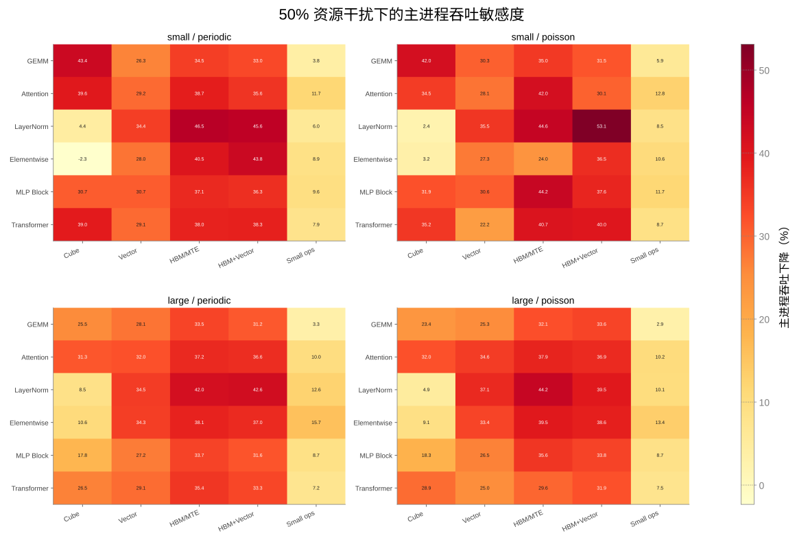
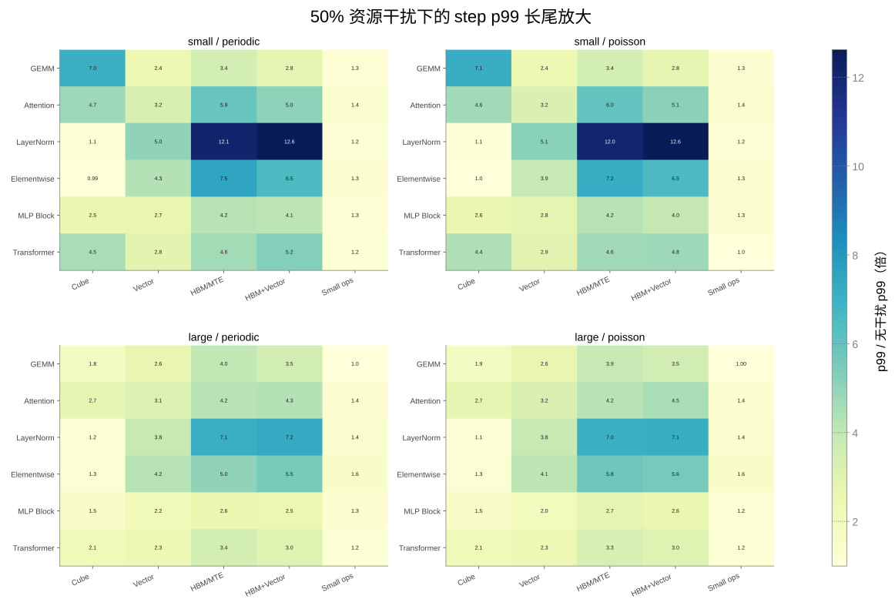
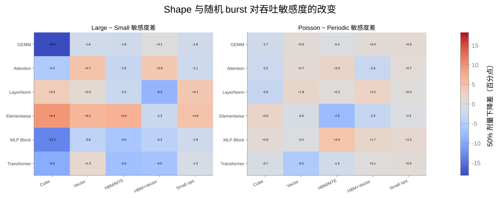
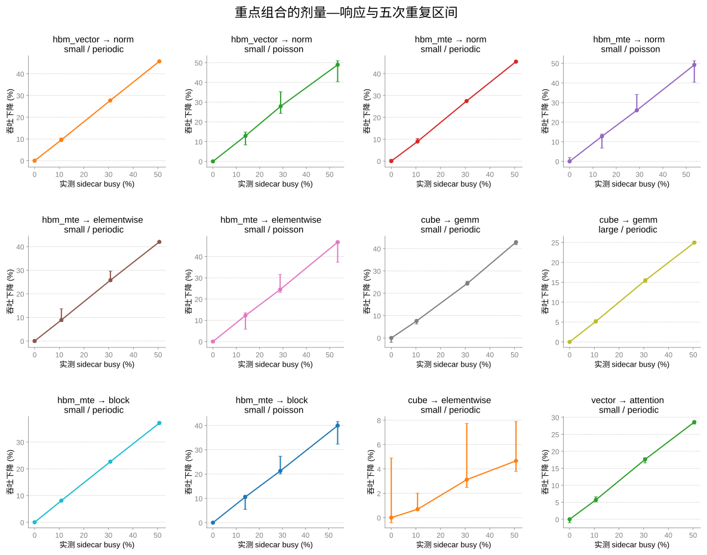
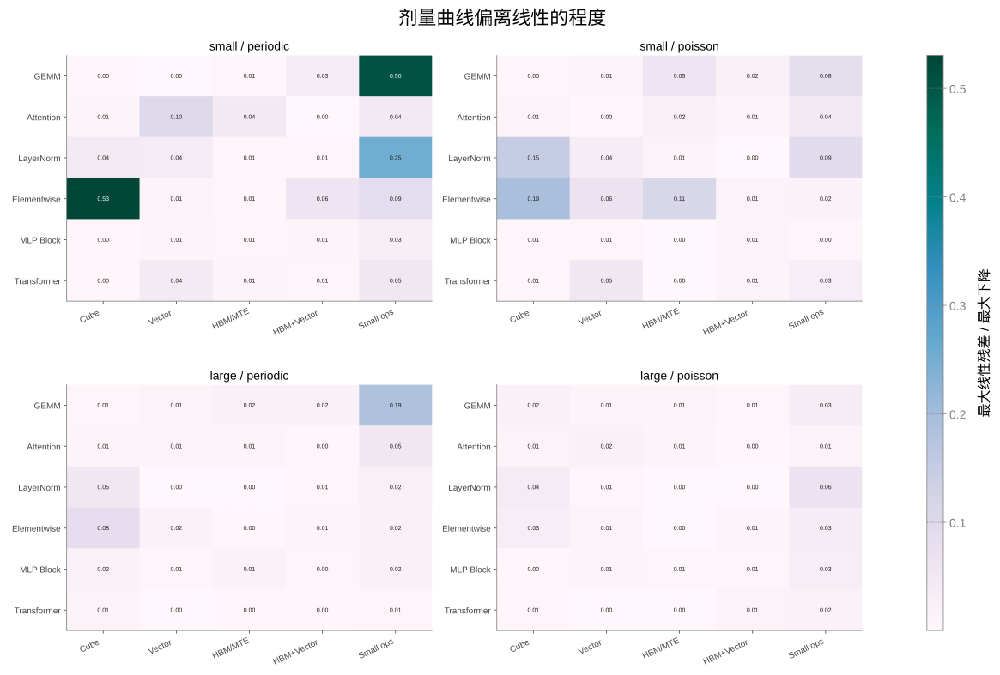

# npu-dev-1 多维资源干扰敏感度图谱（主要实验报告）

> 筛选：`20260715_183000-sensitivity-atlas-d11-screen`  
> 重点复核：`20260715_190000-sensitivity-atlas-d11-targeted-r5`  
> 物理卡：d11；镜像：`quay.io/ascend/vllm-ascend:v0.19.1rc1`

本报告是当前主实验交付。前序 `controlled-interference` 实验负责证明 sidecar 剂量可控；本实验在同一控制协议上扩展 injector、victim、shape 和 burst pattern，并用重点重复区分真实敏感度与单次筛选噪声。历史硬件基线、HCCL/DP/TP 基线和协议修正见 myportal `results/npu-dev-1/RESULTS.md`。

## 结论

本实验得到的是条件敏感度图谱，而不是另一条统一直线：

1. 筛选覆盖 5 类干扰、6 类 victim、2 档 shape、2 种时间模式、4 个剂量，共 **120 个组合、480 个窗口**；全部成功。
2. 选择 12 个高敏感、强 shape 差异或筛选异常的组合，每档重复 5 次，共 **240 个复核窗口**；全部成功。
3. 同一个 50% 软件 busy 剂量下，主进程吞吐下降从约 **3% 到 53%**；不同资源和算子的敏感度不是一个常数。
4. 重点复核中，每增加 1 个百分点实际 busy，吞吐下降的局部斜率从 **0.096 到 0.918 个百分点**，相差约 9.6 倍。
5. LayerNorm 对 HBM/MTE 与 HBM+Vector 最敏感：吞吐下降约 46%～49%，step p99 放大约 12～13 倍。
6. 相同 Cube 干扰对 small GEMM 的下降为 42.86%，对 large GEMM 为 24.96%，对 small Elementwise 仅 4.66%；**victim shape 和算子类型决定传导强度**。
7. 固定资源、victim、shape 和时间模式后，0～50% 剂量曲线多数仍近似线性；但斜率、长尾和随机波动强烈依赖上下文。因此正确模型是条件响应面，而不是全局单斜率。

## 实验变量

### 干扰源

- `cube`：预分配输出的 fp16 `torch.mm(..., out=out)`；
- `vector`：大张量逐元素乘加；
- `hbm_mte`：512 MiB `Tensor.copy_`，同时经过 MTE 与 HBM；
- `hbm_vector`：512 MiB 大张量逐元素乘，联合使用 HBM 与 Vector；
- `small_ops`：连续小规模 add/mul，施压小算子发射与 Vector。

### victim

- GEMM；
- QKᵀ→softmax→PV Attention 前向+反向；
- LayerNorm 前向+反向；
- SiLU/gate/residual Elementwise 前向+反向；
- MLP Block 前向+反向+AdamW；
- Attention+MLP Transformer layer 前向+反向。

small profile 为 hidden/gemm=2048、seq=512、heads=16；large profile 为 4096、1024、32。

### 时间模式

- `periodic`：每 100 ms 固定 busy 预算；
- `poisson`：on/off 时长服从指数分布，形成不规则 burst。

每个筛选组合测 target duty 0/10/30/50%，每窗 2 秒。分析横轴使用 sidecar **实测同步 busy 比例**，不是只使用配置标签。

## 吞吐敏感度全图

每个格子表示目标 50% 干扰时，主进程整窗完成速率相对无干扰基线下降多少。列是第二进程执行的底层压力算子，行是被测训练算子；四个面板分别改变 small/large shape 和固定周期/Poisson burst。数据来自 d11 单卡、每窗 2 秒的 Stage B 筛选。

按干扰源汇总，50% 剂量下的吞吐下降中位数及筛选范围：

| 干扰源 | 所有 victim/shape/pattern 中位 | 筛选范围 |
|---|---:|---:|
| Cube | 26.00% | -2.32%～43.42% |
| Vector | 29.16% | 22.25%～37.10% |
| HBM/MTE copy | 37.96% | 23.97%～46.50% |
| HBM+Vector | 36.54% | 30.12%～53.09% |
| Small ops | 8.83% | 2.90%～15.74% |

筛选中的负值和个别异常不能直接当结论；例如 Cube→small Elementwise 从单次 -2.32% 经五次复核变为 +4.66%，说明低敏感组合必须重复。

## step 长尾敏感度

格子是干扰剂量最高点的 step p99 除以无干扰 p99。p99 表示最慢 1% step 的墙钟耗时，底层采集链路是每个 victim step 后 `torch.npu.synchronize()`，再用 host `perf_counter` 计时。固定周期和随机 burst 即使平均吞吐接近，也可能形成完全不同的尾部停顿。

最突出的是：

- HBM+Vector → small LayerNorm：p99 约 13.22 倍；
- HBM/MTE → small LayerNorm：p99 约 12.44 倍；
- HBM/MTE → small Elementwise：p99 约 7.85～7.97 倍；
- Cube → small GEMM：p99 约 6.98 倍；
- HBM/MTE → small MLP Block：p99 约 4.18～4.43 倍。

这说明仅看平均 throughput 会漏掉训练中的间歇性慢 step。

## Shape 与时间模式不是次要参数

左图是 large 相对 small 的 50% 剂量吞吐下降差；右图是 Poisson 相对 periodic 的差。正数表示该条件更敏感，负数表示更不敏感。相同底层算子和平均 duty 下，仅改变 shape 或 burst 到达方式，下降可变化十几个百分点。

典型 shape 差异：

- Cube→GEMM：small 42.86%，large 24.96%，相差 17.90 个百分点；
- Cube→MLP Block：筛选中 large 比 small 低约 13 个百分点；
- HBM/MTE→Elementwise：large/Poisson 比 small/Poisson 高约 15.6 个百分点；
- HBM+Vector→LayerNorm：small 比 large 更敏感约 13.6 个百分点。

Poisson 模式的五次重复 CV 可达 9%～13%，周期模式多数低于 1%。因此随机 burst 的核心结果不仅是均值变化，还包括试次间方差和 p99。

## 剂量曲线与重点复核

横轴是 sidecar 实测 busy，纵轴是 victim 吞吐下降；误差棒为五次重复下降量的 10%～90% 分位区间。底层压力、victim API 和 shape 均保持固定，只改变剂量；Poisson 组合因有限 2 秒窗内实际 burst 数不同，区间明显更宽。

| 干扰 → victim | profile/pattern | 实测最高 busy | 吞吐下降 | p99 放大 | 每 1pp busy 的下降 |
|---|---|---:|---:|---:|---:|
| HBM+Vector → Norm | small/periodic | 50.6% | 45.72% | 13.22× | 0.905 pp |
| HBM+Vector → Norm | small/poisson | 53.4% | 48.92% | 12.81× | 0.918 pp |
| HBM/MTE → Norm | small/periodic | 50.6% | 45.51% | 12.44× | 0.905 pp |
| HBM/MTE → Norm | small/poisson | 53.5% | 49.19% | 12.30× | 0.918 pp |
| HBM/MTE → Elementwise | small/periodic | 50.5% | 42.00% | 7.85× | 0.834 pp |
| HBM/MTE → Elementwise | small/poisson | 53.4% | 46.80% | 7.97× | 0.874 pp |
| Cube → GEMM | small/periodic | 50.6% | 42.86% | 6.98× | 0.847 pp |
| Cube → GEMM | large/periodic | 50.4% | 24.96% | 1.84× | 0.497 pp |
| HBM/MTE → MLP Block | small/periodic | 50.7% | 37.11% | 4.18× | 0.731 pp |
| HBM/MTE → MLP Block | small/poisson | 53.9% | 39.93% | 4.43× | 0.739 pp |
| Cube → Elementwise | small/periodic | 50.6% | 4.66% | 1.09× | 0.096 pp |
| Vector → Attention | small/periodic | 50.5% | 28.60% | 3.17× | 0.570 pp |

## 非线性在哪里

格子是四个剂量点相对最佳线性拟合的最大绝对残差，再除以该组合最大吞吐下降。数值越大，代表阈值、饱和或单次测量噪声越值得复核。拟合横轴使用 sidecar 实测 busy；每组合仅四点，因此该图用于筛选，不能单独证明物理非线性。

最强“表观非线性”主要出现在 Cube/Small-ops 对 Elementwise、Norm、GEMM 等低效应组合。五次复核后，Cube→small Elementwise 的最高下降只有 4.66%、R² 约 0.989；这更接近“小效应下噪声占比大”，而不是明确的硬件阈值。相反，高敏感 HBM 路径的平均吞吐曲线通常很直，但其 p99 和 Poisson 试次方差很大。

## 如何理解“仍然接近线性”

这轮并没有为了迎合目标而强行寻找曲线弯折。数据表明：

- 在固定 injector、victim、shape、pattern 后，实际 busy 与平均吞吐下降通常近似线性；
- 但斜率不是资源的固有常数，而是上述条件共同决定的局部敏感度；
- 随机 burst 的主要非线性表现为试次方差、p95/p99 和相位重叠，而不一定表现为平均吞吐曲线弯曲；
- 因此后续模型应使用 `sensitivity[injector, victim, shape, pattern, metric]`，不能把所有数据压成一条线。

## 局限

1. Stage B 每组合只有一次，用于筛选结构；只有 12 个组合完成五次复核。
2. Poisson 窗只有 2 秒，实际 busy 会在目标附近随机波动；拟合已使用实测 busy。
3. `hbm_mte` 与 `hbm_vector` 都不是纯 MTE/HBM 隔离。
4. 当前是单卡合成算子；尚未加入 HCCL、TP/DP 最慢 rank 和真实训练 trace replay。
5. Attention 使用显式 QKᵀ/softmax/PV，不等同于所有训练栈的融合 Attention kernel。

## 下一步

1. 从真实 Transformer 训练采集 Attention、MLP、Norm、通信阶段的时间序列，直接 replay burst 间隔和持续时间；
2. 增加 HCCL AllReduce/AllGather/ReduceScatter 干扰维度；
3. 对 DP/TP 单 rank 注入，输出全局 step、最慢 rank 和同步放大系数；
4. 对 LayerNorm、Elementwise 等高 HBM 敏感组合增加 Ascend 性能计数器，区分 MTE、HBM 与调度等待。

## 数据与代码

- 本目录：交付用报告与图（`REPORT.md` + `figs/`）。
- 原始筛选数据：myportal `results/npu-dev-1/20260715_183000-sensitivity-atlas-d11-screen/`（`atlas_analysis.json`、`atlas_rows.csv`、120 份 summary/JSONL）。
- 五次复核：myportal `results/npu-dev-1/20260715_190000-sensitivity-atlas-d11-targeted-r5/`。
- 代码（lab-workspace `ops/cluster`）：
  - `scripts/cluster/npu_controlled_sidecar.py`
  - `scripts/cluster/controlled_interference_bench_npu.py`
  - `scripts/cluster/sensitivity_atlas_screen_npu.py`
  - `scripts/cluster/run_sensitivity_atlas_matrix.py`
  - `reports/analyze_sensitivity_atlas.py`
  - `reports/plot_sensitivity_atlas.py`
